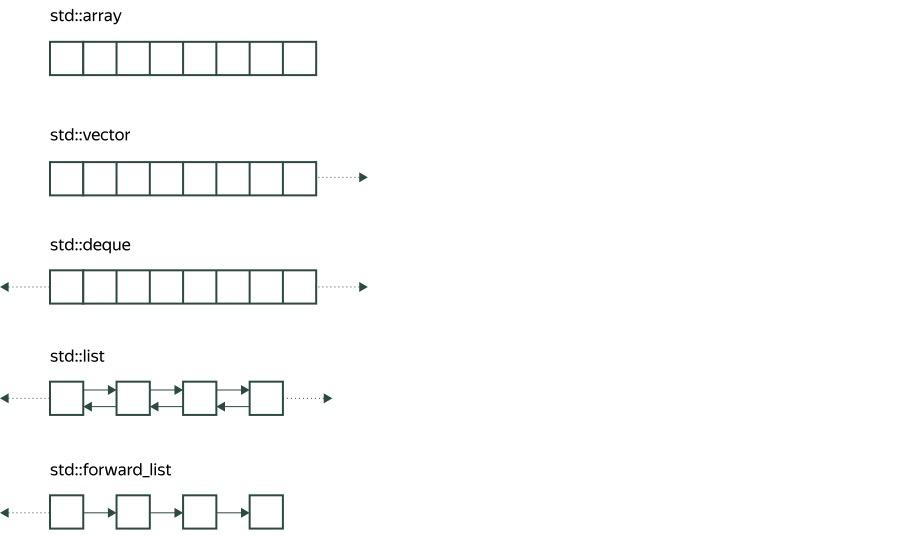
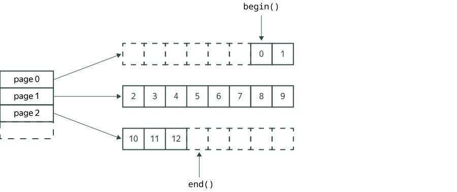

# Тема №11. Последовательные контейнеры 🐱

Стандартная библиотека **C++** содержит набор шаблонных контейнеров. С некоторыми из них мы уже знакомы: это `std::vector` и `std::string`. Эти два контейнера гарантируют, что элементы (в случае `string` — символы строки) будут храниться в непрерывном фрагменте памяти. Эти контейнеры умеют эффективно добавлять элементы в конец, делая реаллокацию при необходимости, но не могут обеспечить эффективную вставку или удаление элементов в других позициях.

В этой теме мы рассмотрим другие последовательные контейнеры. Они не обязательно хранят элементы в непрерывном куске памяти, но позволяют обойти элементы в последовательном порядке.

<div align="center">
  
</div>

> Как правило, контейнеры определены в одноимённом заголовочном файле стандартной библиотеки.

## 🍟 Контейнер `std::array`

Если вам нужен массив фиксированного, известного в момент компиляции размера, то используйте `std::array`. Вот так можно объявить `array` из трёх элементов:

```cpp
#include <array>

int main() {
    std::array<int, 3> point = {1, 2, -3};
}
```

Внутри `array<T, N>` является обёрткой над низкоуровневым массивом `T[N]`, но предоставляет интерфейс стандартного контейнера: знает свой размер, умеет присваиваться, предоставляет итераторы и т. д. Как и у вектора, элементы `array` располагаются в памяти непрерывно, но хранятся не в динамической памяти, а на стеке.

Важно подчеркнуть, что размер `array` должен быть задан в момент компиляции и не может изменяться во время работы программы.

## 🍔 Контейнер `std::deque`

Deque расшифровывается как `double-ended queue` (двусторонняя очередь).

Если вектор располагает элементы в памяти непрерывно, то `std::deque` располагает их кусочно-непрерывно, в отдельных страницах (непрерывных блоках) памяти фиксированного размера. Но даже для хранения одного элемента в деке будет выделена целая страница. Сами страницы не обязательно расположены в памяти подряд. Отдельно поддерживается перечень указателей на начала страниц. Размеры страниц зависят от `sizeof(T)` и от конкретной реализации дека. Например, для `std::deque<int>` они могут занимать 4 килобайта.

<div align="center">
  
</div>

Дек умеет эффективно добавлять и удалять элементы в начале и в конце: это приводит к выделению новой страницы при необходимости. Вставка по краям в деке эффективнее, чем в векторе, так как реаллокаций нет и старые элементы никогда не приходится копировать. В отличие от вектора, дек гарантирует, что при вставке или удалении по краям элементы останутся в тех же самых ячейках памяти, что и были. Вставка в середину дека и удаление из неё уже требуют сдвига элементов.

Как и вектор, дек поддерживает обращение к элементу по индексу за `O(1)`: так как размер страниц фиксирован и начальная позиция в первой странице известна, то можно легко вычислить нужную страницу и позицию в ней. Однако для обращения к элементу деку приходится делать два разыменования указателей, а вектору — только одно.

```cpp
#include <deque>
#include <iostream>

int main() {
    std::deque<int> d = {1, 2, 3, 4};

    d.push_back(5);  // добавление в конец, как у вектора
    d.push_back(6);
    d.pop_back();  // удаление из конца, как у вектора

    d.push_front(0);  // добавление в начало
    d.push_front(-1);
    d.pop_front();  // удаление из начала

    // элементы дека: 0, 1, 2, 3, 4, 5

    // обращение по индексам:
    for (size_t i = 0; i != d.size(); ++i) {
        std::cout << d[i] << "\n";
    }

    // range-based for:
    for (int x : d) {
        std::cout << x << "\n";
    }
}
```

## 🥬 Контейнер `std::list`

Двусвязный список `std::list` хранит элементы в отдельных узлах. Узлы могут располагаться в разных местах памяти, никакого требования непрерывности нет. В узле рядом с самим элементом хранится указатель на предыдущий и следующий узлы. Можно представить себе отдельный узел двусвязного списка для элементов типа `T` примерно так:

```cpp
template <typename T>
struct Node {
    T value;
    Node* prev;
    Node* next;
};
```

Сам список хранит указатели на начальный и конечный узлы. К узлу нельзя эффективно обратиться по номеру (для этого пришлось бы идти в цикле по списку начиная от головы). Поэтому пройтись по списку можно только с помощью `range-based for` или итераторов:

```cpp
#include <iostream>
#include <list>

int main() {
    std::list<int> l = {10, 15, 20};
    l.push_front(5);
    l.push_front(0);

    l.push_back(25);
    l.push_back(30);

    l.pop_front();
    l.pop_back();

    for (int x : l) {
        std::cout << x << "\n";  // 5 10 15 20 25
    }
}
```

## 🥑 Итераторы списка

**Итераторы** — это специальные объекты, предназначенные для навигации по контейнеру. Итераторы позволяют обращаться к текущему элементу контейнера и сдвигаться к соседним элементам. Итератор, указывающий на начальный элемент контейнера, возвращает функция `begin`.

```cpp
#include <iostream>
#include <list>

int main() {
    std::list<int> l = {10, 15, 20};

    // Используем auto, чтобы не писать громоздкий тип std::list<int>::iterator
    auto iter = l.begin();
    std::cout << *iter << "\n";  // печатаем начальный элемент
    ++iter;  // сдвигаемся к следующему элементу
    --iter;  // возвращаемся назад
}
```

Итераторы в **C++** создавались по подобию указателей: их можно разыменовывать (`*`) и сдвигать (`++` и `--`). Однако операторы `++` и `--` для обычных указателей сдвигаются на соседние ячейки памяти, а двусвязный список хранит свои элементы разрозненно. Поэтому указатели могут подойти на роль итераторов лишь для контейнеров с непрерывным хранением (`array`, `vector` и `string`).

Функция `end` у контейнера возвращает особый итератор, который указывает за последний элемент контейнера. Этот итератор нельзя разыменовывать. С ним можно только сравниваться:

```cpp
#include <iostream>
#include <list>

int main() {
    std::list<int> l = {10, 15, 20};
    for (auto iter = l.begin(); iter != l.end(); ++iter) {
        std::cout << *iter << "\n";  // печатаем элементы списка через итератор
    }

    for (auto iter = l.rbegin(); iter != l.rend(); ++iter) {
        std::cout << *iter << "\n";  // проход по списку в обратном порядке
    }
}
```

С помощью итераторов можно вставлять (`insert`) или удалять (`erase`) элементы или целые цепочки элементов в любом месте списка:

```cpp
#include <iostream>
#include <list>

int main() {
    std::list<int> l = {0, 10, 15, 20};

    auto iter = l.begin();
    ++iter;
    l.insert(iter, 5);  // вставляем на эту позицию элемент

    // Удаляем из списка чётные числа
    for (auto iter = l.begin(); iter != l.end(); ) {
        if (*iter % 2 == 0) {
            iter = l.erase(iter);  // возвращается итератор на элемент, следующий за удалённым
        } else {
            ++iter;
        }
    }

}
```

С итераторами стандартных контейнеров мы познакомимся подробнее в других темах. Заметим пока, что к итераторам списка (в отличие от итераторов вектора) нельзя прибавлять произвольные целые числа, чтобы сдвинуть их на несколько позиций вперёд: эта операция не может быть реализована эффективно за константное время. 

Стандартная функция `std::advance` из заголовочного файла `iterator` умеет делать это за константное время для итераторов контейнеров с индексацией и за линейное время для итераторов списка. А функции `std::next` и `std::prev` возвращают следующее и предыдущее значения итератора соответственно.

```cpp
#include <iterator>
#include <list>

int main() {
    std::list<int> l = {0, 10, 15, 20};

    // вместо этого удобнее воспользоваться функцией std::next:
    // auto iter = l.begin();
    // ++iter;

    auto iter = std::next(l.begin());  // итератор указывает на второй элемент списка

    std::advance(iter, 2);  // итератор указывает на последний элемент
}
```

## 🍕 Контейнер `std::forward_list`

Односвязный список `std::forward_list` нужен там, где требуется сэкономить память на хранении ссылок на предыдущий узел. По такому контейнеру можно пройтись только вперёд, а вставка разрешена только в начало (или после указанного итератора). Этот контейнер встречается в некоторых реализациях хеш-таблицы `unordered_map` для хранения элементов с одинаковыми хешами.

```cpp
#include <forward_list>
#include <iostream>
#include <iterator>

int main() {
    std::forward_list<int> fl = {3, 42, 5};
    fl.push_front(2);
    // fl.push_back(10);  // ошибка компиляции!

    auto iter = std::next(fl.begin());
    iter = fl.erase_after(iter);
    fl.insert_after(iter, 4);

    for (int x : fl) {
        std::cout << x << "\n";  // 2 3 5 4
    }
}
```

Функции `insert_after` и `erase_after` своими названиями подчёркивают своё отличие от `insert` и `erase` у других контейнеров, работающих с текущей позицией. В односвязном списке не получится вставить элемент на текущую позицию, как это делает `insert` в `std::list`, поскольку к предыдущему элементу невозможно обратиться, а его ссылку на следующий элемент надо поправить.

**Упражнение:** сравните интерфейсы (набор функций) контейнеров `list` и `forward_list` и объясните различия.

## 🍓 Инвалидация итераторов и ссылок

Если контейнер изменяется, то в некоторых случаях итераторы и ссылки (указатели) на элементы могут стать **невалидными**.

**Рассмотрим пример:**

```cpp
#include <iostream>
#include <vector>

int main() {
    std::vector<int> v = {1, 2, 3, 4};

    auto iter = v.begin();  // итератор
    int* ptr = &v.front();  // указатель
    int& ref = v.front();  // ссылка

    std::cout << *iter << " " << *ptr << " " << ref << "\n";  // 1 1 1

    v.push_back(5);  // происходит реаллокация

    // обращаться к старым итераторам, указателям и ссылкам больше нельзя:
    std::cout << *iter << " " << *ptr << " " << ref << "\n";  // неопределённое поведение!
}
```

В этом примере показано, что итераторы, указатели или ссылки могут оказаться невалидными, если у вектора произошла реаллокация. Рассмотрим, как ведут себя итераторы других последовательных контейнеров при добавлении элементов в конец. Указатели и ссылки тут либо вместе инвалидируются, либо вместе остаются валидными, так как они в конечном итоге смотрят на память, которую занимал элемент.

- Строка `std::string` ведёт себя так же, как и вектор: все итераторы и ссылки инвалидируются.
- В `std::array` ничего вставить нельзя, его размер фиксирован.
- В `std::deque` инвалидируются итераторы, но не инвалидируются ссылки и указатели! Сами элементы дека остаются в тех же местах памяти, но во внутреннем векторе страниц, про который должен знать итератор дека, вообще говоря, может произойти реаллокация.
- В `std::list` и `std::forward_list` ни итераторы, ни ссылки не инвалидируются. Так что если в приведённом примере заменить `vector` на `list`, то он будет корректно работать.

Валидность итераторов и ссылок после вызова той или иной функции контейнера описывается в документации (вот пример для push_back у вектора). Также можно обратиться к [этой таблице](https://en.cppreference.com/w/cpp/container.html#Iterator_invalidation).

---

## 📌 Задачи для практики

### 🧩 Задача 1. Среднее арифметическое массива (`std::array`)

**Тема:** базовое использование `std::array`, итераторы, работа с фиксированными массивами.

**Задание:**
Создайте `std::array<int, 10>` и заполните его числами от `1` до `10`. Рассчитайте среднее арифметическое элементов массива и выведите его с точностью до 2 знаков после запятой.

**Подсказка:**
Используйте диапазонный цикл `for (auto x : arr)` и `std::accumulate из <numeric>`.

---

### 🧩 Задача 2. Очередь заказов (`std::deque`)

**Тема:** двухсторонняя очередь, добавление и удаление элементов с обеих сторон.

**Задание:**
Смоделируйте очередь заказов, где заказы поступают и выполняются не по строгому порядку:

- Добавляйте новые заказы в конец (`push_back`).
- Срочные заказы вставляйте в начало (`push_front`).
- Удаляйте выполненные заказы из начала очереди (`pop_front`).

После обработки всех заказов выведите, какие заказы остались.

**Подсказка:**
Используйте `std::deque<std::string>` и методы `push_front`, `push_back`, `pop_front`.

---

### 🧩 Задача 3. Сортировка списка студентов (`std::list`)

**Тема:** работа с двусвязным списком, встроенная сортировка.

**Задание:** Создайте `std::list<std::string>` с фамилиями студентов:
`{"Иванов", "Петров", "Сидоров", "Алексеев", "Борисов"}`
Отсортируйте список в алфавитном порядке и выведите его на экран.

**Усложнение:**
Удалите из списка фамилии, начинающиеся на букву `'А'`.

**Подсказка:**
Используйте `list.sort()` и `list.remove_if()` с лямбда-функцией.

---

### 🧩 Задача 4. Обратная вставка элементов (`std::forward_list`)

**Тема:** односвязный список, работа с итераторами-вставками.

**Задание:**
Создайте `std::forward_list<int>` и вставьте в него числа 1, 2, 3, 4, 5 в обратном порядке, чтобы на выходе получился список `[1, 2, 3, 4, 5]`.

**Подсказка:**
Используйте `insert_after` и `before_begin()`.

---

### 🧩 Задача 5. Объединение и фильтрация списков (`std::list`)

**Тема:** операции `merge`, `unique`, `remove_if`.

**Задание:**
Даны два отсортированных списка:
```cpp
list<int> a = {1, 3, 5, 7};
list<int> b = {2, 3, 6, 7, 8};
```

Объедините их в один, удалите дубликаты и элементы больше 6.

**Результат:**
На выходе должен получиться список: `{1, 2, 3, 5, 6}`.

**Подсказка:**
Используйте `a.merge(b)`, затем `a.unique()`, затем `a.remove_if()` с условием `x > 6`.

---

<div align="center"> Made with ❤️ by <b>dv0retsky</b> </div>