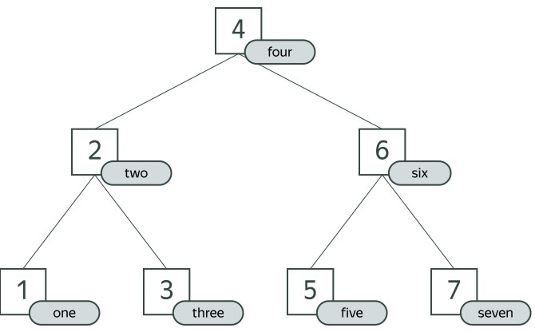
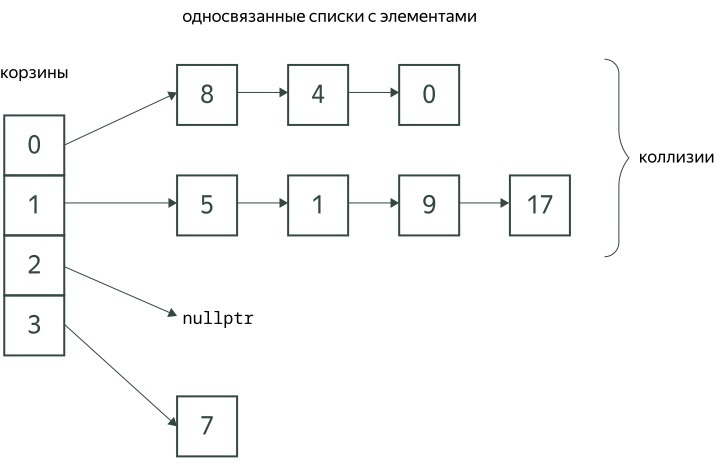

# Тема №13. Асоциативные контейнеры 🌠

**Ассоциативные контейнеры сопоставляют ключам некоторые значения.**

В стандартной библиотеке есть ассоциативные контейнеры, основанные на сбалансированных деревьях поиска (`map`, `set`) и контейнеры, основанные на хеш-таблицах (`unordered_map`, `unordered_set`). В этих контейнерах ключи уникальны, то есть, не могут повторяться. Также существуют и `multi`-версии этих контейнеров, в которых допускаются повторы ключей.

Так как **C++** — статически типизированный язык, типы ключей и значений должны быть строго зафиксированы на этапе компиляции.

## 🌁 Контейнер `std::map`

Начнём с контейнера `std::map`. Он определен в заголовочном файле `map`. Аналогично вектору, `std::map` является шаблонным: в угловых скобках нужно указать типы ключей и значений.

**Рассмотрим пример:**

```cpp
#include <iostream>
#include <map>
#include <string>

int main() {
    // инициализируем map набором пар {ключ, значение}
    std::map<std::string, int> years = {
        {"Moscow", 1147},
        {"Rome", -753},
        {"London", 47},
    };

    for (const auto& [city, year] : years) {
        std::cout << city << ": " << year << "\n";
    }
}
```

**Вывод программы:**

```bash
London: 47
Moscow: 1147
Rome: -753
```

При итерации с помощью `ranged-based for` возвращаются пары `std::pair` из константного ключа и значения. Для итерации по элементам мы использовали [structured binding](https://en.cppreference.com/w/cpp/language/structured_binding.html), прикрепив ссылки `city` и `year` к элементам возвращаемой пары, а также `auto` для автоматического вывода типа. Согласитесь, это удобнее, чем такая форма записи:

```cpp
for (const std::pair<const std::string, int>& item : years) {
    std::cout << item.first << ": " << item.second << "\n";
}
```

Контейнер `map` реализован как [красно-чёрное дерево](https://en.wikipedia.org/wiki/Red–black_tree) — сбалансированное дерево поиска с особыми свойствами. Поэтому его элементы при итерации обходятся в порядке возрастания ключей, а на самих ключах должен быть определён оператор `<` для сравнения.

<div align="center">
  
</div>

Внутренне устройство красно-чёрных деревьев мы оставим за рамками этого курса: для нас важнее научиться пользоваться таким контейнером и знать, что три основных операции — поиск, вставка и удаление элемента — выполняются за логарифмическое время (O(logn)) от числа элементов в контейнере. Покажем, как воспользоваться этими операциями.

```cpp
#include <iostream>
#include <map>
#include <string>

int main() {
    std::map<std::string, int> data;
    std::string key;
    int value;

    while (std::cin >> key >> value) {
        data[key] = value;  // вставка
    }

    data.erase("hello");  // удаление

    // поиск
    if (auto iter = data.find("test"); iter != data.end()) {
        std::cout << "Found the key " << iter->first << " with the value " << iter->second << "\n";
    } else {
        std::cout << "Not found\n";
    }
}
```

**Рассмотрим эту программу подробнее.**

Для вставки мы использовали обращение по ключу в квадратных скобках: `data[key] = value`. В отличие от вектора или дека, ключ теперь не обязательно является индексом: в нашем случае это строка. Альтернативные способы вставки — `data.insert({key, value})` или `data.insert_or_assign(key, value)`.

Эти функции принимают пару из ключа и значения, поэтому нам пришлось обрамить в фигурные скобки `key` и `value`, чтобы экземпляр `std::pair` сконструировался на лету. Если ключ `key` уже существует в контейнере, то `data[key] = value` и функция `insert_or_assign` его перезапишут, а `insert` — нет (но вернет информацию о старом значении).

Удаляя элемент по ключу, можно не заботиться о его наличии в контейнере: если ключа нет, то функция `erase` просто ничего не поменяет.

Для поиска элемента мы вызываем функцию `find`, которая возвращает итератор. Мы пользуемся версией `if` с инициализатором, чтобы сразу сохранить этот итератор в переменную `iter` и потом проверить его значение. Такая переменная будет видна только внутри условного оператора: таким образом мы подчеркнём, что `iter` нам нужен только здесь. Итератор будет либо указывать на пару из найденного ключа и его значения, либо окажется равен значению `data.end()`, если ключ не найден. Обратиться к найденной паре можно через унарную звёздочку или стрелочку (`iter->first` означает `(*iter).first`). Это похоже на указатели, но важно понимать, что итератор ассоциативного контейнера — это не указатель, а самостоятельный объект.

Вернёмся ещё раз к конструкции `data[key]`. Она возвращает ссылку на значение, которому можно что-то присвоить. Сначала она проверяет, есть ли уже такой ключ в контейнере. Если ключа нет, он тут же вставляется в контейнер со значением по умолчанию (`0` для `int`). Затем возвращается ссылка на значение в контейнере.

Такое поведение оператора `[]` требует, чтобы контейнер `data` был изменяемым. Поэтому выражение `data[key]` не скомпилируется, если `data` — константа:

```cpp
void Check(const std::map<std::string, int>& data) {
    if (data["total"] > 0) {  // ошибка компиляции!
        // ...
    }
}
```

Если мы уверены, что ключ в контейнере есть, то можно воспользоваться функцией `at`:

```cpp
void Check(const std::map<std::string, int>& data) {
    if (data.at("total") > 0) {  // OK, это скомпилируется
        // ...
    }
}
```

Если же ключа всё же не окажется, то `at` во время работы программы сгенерирует исключение — «цивилизованную» ошибку, которую можно перехватить и обработать. 

## 🌄 Контейнер `std::unordered_map`

Воспользуемся другой реализацией ассоциативного массива из стандартной библиотеки **C++** — хеш-таблицей `unordered_map`. Само название этого класса подчёркивает, что данные будут храниться не упорядоченными по ключу. Предполагается, что для каждого ключа определена хеш-функция (по умолчанию `std::hash<Key>()`), а по ней вычисляется номер корзины (`bucket`), в которую должен попасть ключ.

Случай, когда два разных ключа оказываются в одной корзине, называется коллизией. В **С++** для разрешения коллизий используется метод цепочек, то есть, внутри одной корзины все элементы выстраиваются в односвязный список.

<div align="center">
  
</div>

Если хеш-функция достаточно равномерна и корзин достаточно много, то в среднем время поиска, добавления и удаления элементов для `unordered_map` будет константным 
O(1)). 

Интерфейс `unordered_map` специально сделан похожим на интерфейс `map`. Нам будет достаточно заменить только заголовочный файл и имя контейнера:

```cpp
#include <iostream>
#include <string>
#include <unordered_map>

int main() {
    std::unordered_map<std::string, int> freqs;
    std::string word;
    while (std::cin >> word) {
        ++freqs[word];
    }
    for (const auto& [word, freq] : freqs) {
        std::cout << word << "\t" << freq << "\n";
    }
}
```

Порядок обхода теперь выглядит произвольным (но на самом деле он диктуется хеш-функцией):

```bash
$ clang++ --std=c++20 -o count_freqs count_freqs.cpp
$ ./count_freqs < text8 | head
storerooms	2
fretensis	1
metzada	1
workmans	1
mikhailgorbachev	1
naevus	3
buildups	1
clandenstine	1
democratised	1
wilgoren	2
```

Время работы сократилось с 5,5 до 3,1 секунды:

```bash
$ clang++ --std=c++20 -O3 -o count_freqs count_freqs.cpp
$ time ./count_freqs < text8 > /dev/null
real    0m3,117s
user    0m3,080s
sys     0m0,036s
```

У контейнера unordered_map есть функция `max_load_factor`, которая задаёт максимально допустимое соотношение между числом элементов и количеством корзин. По умолчанию эта величина равна единице, так что `unordered_map` пытается в среднем вообще избежать коллизий. Но это не означает отсутствия коллизий в отдельных корзинах.

Если при вставке очередного элемента среднее число элементов в корзинах превышает этот порог, число корзин автоматически увеличивается и происходит рехеширование. Чем-то это напоминает реаллокацию у вектора.

Если нам заранее известно финальное количество ключей, то можно вызвать заранее функцию `reserve` и избежать лишних рехеширований при вставках. Тем самым можно отыграть дополнительное время:

```cpp
#include <iostream>
#include <string>
#include <unordered_map>

int main() {
    std::unordered_map<std::string, int> freqs;
    freqs.reserve(300'000);  // можно использовать апостроф для выделения разрядов
    std::string word;
    while (std::cin >> word) {
        ++freqs[word];
    }
    for (const auto& [word, freq] : freqs) {
        std::cout << word << "\t" << freq << "\n";
    }
}
```

```bash
$ clang++ --std=c++20 -O3 -o count_freqs count_freqs.cpp
$ time ./count_freqs < text8 > /dev/null
real   0m3,067s
user   0m3,035s
sys    0m0,032s
```

## 🗾 Из контейнера в контейнер

Вернёмся к сортировке слов по убыванию частоты. Для этого проще всего будет переложить слова с частотами в вектор пар и отсортировать его, используя свою функцию сравнения:

```cpp
#include <algorithm>
#include <iostream>
#include <string>
#include <tuple>
#include <unordered_map>
#include <vector>

int main() {
    std::unordered_map<std::string, int> freqs;
    std::string word;
    while (std::cin >> word) {
        ++freqs[word];
    }

    // копируем пары в вектор, используя шаблонный конструктор от двух итераторов:
    std::vector<std::pair<std::string, int>> sortedByFreq(
        freqs.begin(),
        freqs.end()
    );

    // сортируем с помощью своей лямбда-функции:
    std::sort(
        sortedByFreq.begin(),
        sortedByFreq.end(),
        [](const auto& p1, const auto& p2) {
            // сначала сравниваем частоты по убыванию, потом — слова по возрастанию
            return std::tie(p2.second, p1.first) < std::tie(p1.second, p2.first);
        }
    );

    for (const auto& [word, freq] : sortedByFreq) {
        std::cout << word << "\t" << freq << "\n";
    }
}
```

Здесь мы элегантно копируем данные из `unordered_map` в вектор, указывая при инициализации переменной `sortedByFreq` пару итераторов другого контейнера. Цикл, копирующий элементы из этого диапазона, скрыт в конструкторе вектора.

Посмотрим на первые 10 результатов с помощью консольной утилиты head. Теперь мы в самом деле получили наиболее частотные слова из файла:

```bash
$ clang++ --std=c++20 -o count_freqs count_freqs.cpp
$ ./count_freqs < text8 | head
the	1061396
of	593677
and	416629
one	411764
in	372201
a	325873
to	316376
zero	264975
nine	250430
two	192644
```

## 🎑 Контейнеры `std::set` и `std::unordered_set`

Контейнеры `std::set` и `std::unordered_set` похожи на `map` и `unordered_map` по внутреннему устройству, но они хранят только ключи, без ассоциированных значений. Вот как можно выписать повторяющиеся слова текста в алфавитном порядке (по одному разу каждое):

```cpp
#include <iostream>
#include <set>
#include <string>
#include <unordered_set>

int main() {
    // здесь будем хранить все слова (каждое по одному разу)
    std::unordered_set<std::string> words;

    // здесь будем хранить повторяющиеся слова
    // используем set, а не unordered_set, чтобы потом напечатать их по алфавиту
    std::set<std::string> duplicate_words;

    std::string word;
    while (std::cin >> word) {
        if (words.contains(word)) {
            duplicate_words.insert(word);
        } else {
            words.insert(word);
        }
    }

    for (const auto& word : duplicate_words) {
        std::cout << word << "\n";
    }
}
```

Здесь мы применили функцию contains, которая появилась только в `C++20`. При использовании более старого стандарта нужно написать `if (words.find(word) != words.end())`.

Заметим, что при попадании в `else` мы ищем слово в `words` дважды: один раз для проверки в `contains`, а другой раз — в `insert`. Можно было бы обойтись только одним поиском, воспользовавшись тем, что `insert` возвращает пару из итератора на элемент и флажка с результатом поиска:

```cpp
#include <iostream>
#include <set>
#include <string>
#include <unordered_set>

int main() {
    std::unordered_set<std::string> words;
    std::set<std::string> duplicate_words;
    std::string word;
    while (std::cin >> word) {
        auto [iter, has_been_inserted] = words.insert(word);
        if (!has_been_inserted) {
            duplicate_words.insert(word);
        }
    }
    for (const auto& word : duplicate_words) {
        std::cout << word << "\n";
    }
}
```

Название `set` происходит от математического понятия множества, где элементы хранятся только по одному разу. Однако никаких теоретико-множественных операций (объединения, пересечения, разности) у `set` и `unordered_set` не предусмотрено.

## 🌅 Мультиконтейнеры

В стандартной библиотеке **C++** есть четыре мультиконтейнера:

- `std::multimap` (в заголовочном файле `map`);
- `std::multiset` (в заголовочном файле `set`);
- `std::unordered_multimap` (в заголовочном файле `unordered_map`);
- `std::unordered_multiset` (в заголовочном файле `unordered_set`).

Они аналогичны обычным ассоциативным контейнерам, которые мы рассматривали выше, но в мультиконтейнерах один и тот же ключ может встретиться несколько раз.

Пусть, например, мы хотим сохранять для каждого слова в текстовом файле его порядковый номер. Слова в тексте могут повторяться, поэтому воспользуемся контейнером `multimap`:

```cpp
#include <iostream>
#include <map>

int main() {
    std::multimap<std::string, int> positions;

    std::string word;
    int position = 0;
    while (std::cin >> word) {
        positions.insert({word, position});
        ++position;
    }
}
```

В этом случае мы могли бы применить вместо `std::multimap<std::string, int>` контейнер `std::map<std::string, std::vector<int>>`. Разница будет в использовании и в накладных расходах.

Для обхода `multimap` потребуется один цикл, а для `map` с вектором — два вложенных цикла (по ключам и по элементам вектора для данного ключа). Вектор имеет накладные расходы на хранение метаинформации и резерва, а в `multimap` все данные будут храниться в одном сбалансированном дереве.

Наконец, итераторы `multimap` стабильны, а у вектора могут инвалидироваться. Применять `multimap` имеет смысл там, где повторы ключей сравнительно редки.

## 🎆 Итераторы ассоциативных контейнеров

Контейнеры `map`, `set` и их мультиверсии предоставляют двусторонние итераторы, которые можно сдвигать на соседние позиции вперёд и назад. Как и в случае последовательных контейнеров, запрещено выходить за пределы диапазона, ограниченного `begin()` и `end()`, и разыменовывать итератор, равный `end()`. Итераторы таких контейнеров и ссылки (указатели) на элементы никогда не инвалидируются.

```cpp
#include <iostream>
#include <iterator>
#include <map>
#include <string>

int main() {
    std::map<int, std::string> numbers = {
        {100, "hundred"},
        {3, "three"},
        {42, "forty two"},
        {11, "eleven"},
    };

    auto iter = numbers.find(11);

    if (iter != numbers.end()) {
        // печатаем найденный элемент
        const auto& [key, value] = *iter;
        std::cout << "Found: " << key << ": " << value << "\n";  // Found: 11: eleven

        // печатаем предыдущий элемент
        if (iter != numbers.begin()) {
            const auto& [key, value] = *std::prev(iter);
            std::cout << "Previous: " << key << ": " << value << "\n";  // Previous: 3: three
        } else {
            std::cout << "No previous element\n";
        }

        // печатаем следующий элемент
        if (auto nextIter = std::next(iter); nextIter != numbers.end()) {
            const auto& [key, value] = *nextIter;
            std::cout << "Next: " << key << ": " << value << "\n";  // Next: 42: forty two
        } else {
            std::cout << "No next element\n";
        }
    } else {
        std::cout << "Not found\n";
    }
}
```

Может показаться, что в строке `const auto& [key, value] = *std::prev(iter)` мы строим висячие ссылки, так как возвращаемое значение функции `prev` после вычисления всего выражения сразу станет невалидным. Однако константные ссылки продлевают жизнь объекта до конца текущего блока.

Итераторы `unordered`-контейнеров однонаправленные: их можно сдвигать только вперёд. Это связано с тем, что коллизии в хеш-таблице обычно разрешаются с помощью односвязного списка элементов, а по односвязному списку нельзя двигаться назад. Итераторы unordered-контейнеров могут инвалидироваться только если произошло рехеширование при вставке. Ссылки и указатели никогда не инвалидируются.

Отдельно отметим функцию `erase` у ассоциативных контейнеров. У неё есть несколько перегруженных версий. Одна версия принимает ключ, другая — итератор удаляемого элемента, третья — диапазон итераторов. Разница будет для мультиконтейнеров: если какой-то ключ повторяется, то первая версия `erase` удалит все вхождения таких ключей, а вторая — только конкретные:

```cpp
#include <unordered_map>

int main() {
    std::unordered_multimap<std::string, int> data = {
        {"a", 1},
        {"a", 2},
        {"a", 3},
        {"b", 4},
    };

    auto iter = data.find("a");
    if (iter != data.end()) {
        data.erase(iter);  // удаляем первое найденное вхождение с ключом "a"
    }

    data.erase("a");  // удаляем все остальные вхождения с ключом "a"
}
```

## 📌 Задачи для практики

### 🧩 Задача 1. Нахождение общих букв во всех словах

**Условие задачи**: Даны слова, состоящие из строчных латинских букв. Необходимо найти все буквы, которые присутствуют в **каждом** из данных слов, и вывести их в алфавитном порядке без пробелов.

**Ограничения:**
- Длина каждого слова ≤ 100 символов
- Количество слов ≤ 1000

**Формат ввода**

```bash
apple
peach
```

**Формат вывода**

```bash
aep
```

**Объяснение**: Буквы `'a'`, `'e'`, `'p'` присутствуют и в `"apple"`, и в `"peach"`.

---
### 🧩 Задача 2. Предметный указатель книги

**Условие задачи**: Профессор Колбасов составил предметный указатель для своей книги. Для каждого ключевого слова указаны страницы, на которых оно встречается. Необходимо для каждой страницы выписать в алфавитном порядке все уникальные ключевые слова, которые на ней встречаются.

**Ограничения:**
- Количество слов n ≤ 1000
- Номер страницы ≤ 1000
- Длина ключевого слова ≤ 16 символов
- Слова состоят из латинских букв, не пустые

**Формат ввода**

```bash
5
derivative 10
function 2
function 10
function 10
limit 7
```

**Формат вывода**

```bash
2 function
7 limit
10 derivative function
```

---

<div align="center"> Made with ❤️ by <b>dv0retsky</b> </div>