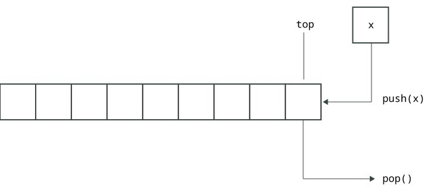
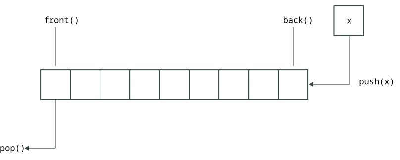
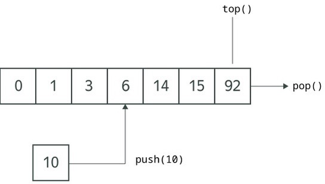
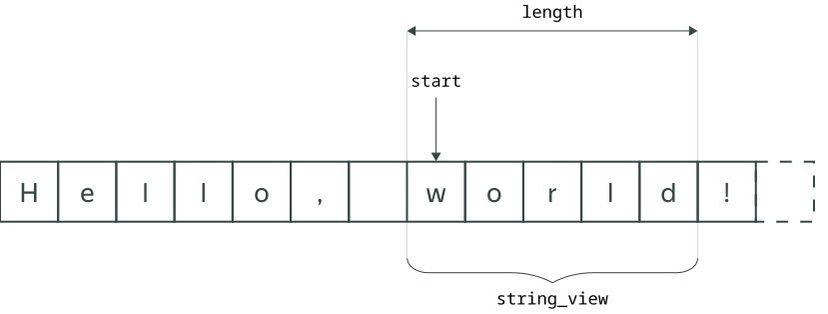

# Тема №15. Адаптеры и представления

**Адаптеры над стандартными контейнерами** — это не самостоятельные контейнеры. Они используют какой-нибудь другой контейнер (например, дек или вектор) для хранения своих элементов, но при этом предоставляют свой набор функций для работы с ними. В стандартной библиотеке есть адаптеры `std::stack`, `std::queue` и `std::priority_queue`.

Представления (`views`) не владеют памятью, а лишь ссылаются на диапазон значений другого контейнера. Представлением можно считать пару итераторов. В **С++20** появилась обширная библиотека [**ranges**](https://en.cppreference.com/w/cpp/ranges.html) для работы с представлениями. В этом параграфе мы рассмотрим конструкцию `string_view`, представляющую фрагмент строки.

## Адаптер `std::stack`

Стек — это последовательность элементов, в которую разрешается добавлять и извлекать элементы только с одной стороны. Обращение к промежуточным элементам не допускается. Говорят, что структура данных «стек» реализует идею `LIFO (last in — first out)`.

Понятно, что эти действия можно сделать с помощью вектора или дека и операций `push_back` и `pop_back`. Адаптер [**std::stack**](https://en.cppreference.com/w/cpp/container/stack.html) является обёрткой над такими контейнерами с особым интерфейсом — функциями `push`, `pop` и `top`. Это позволяет более выразительно подчеркнуть, что используется не просто какой-то контейнер, а именно стек как структура данных.

<div align="center">
  
</div>

```cpp
#include <iostream>
#include <stack>

int main() {
    std::stack<int> s;
    s.push(1);
    s.push(13);
    s.pop();  // удалить элемент с вершины стека (в стеке останется 1)

    std::cout << s.top() << "\n";  // получить элемент на вершине стека, не удаляя его

    if (s.empty()) {  // проверка на пустоту
       std::cout << "Stack is empty\n";
    }
}
```

Функция `pop` ничего не возвращает. Напротив, функция `top` возвращает элемент, но никак не меняет состояние стека. Так было сделано для гарантий безопасности исключений. 

По умолчанию стек использует контейнер `std::deque` для хранения элементов. При желании мы можем указать другой тип этого контейнера. Всё, что требуется от этого контейнера, — это поддержка операций `push_back`, `pop_back`, `back` и `empty`:

```cpp
#include <iostream>
#include <list>
#include <stack>

int main() {
    std::stack<int, std::list<int>> s;  // используем std::list для хранения элементов в стеке
    // ...
}
```

В **C++** есть ещё понятие стека как области памяти для локальных переменных и аргументов функций. Оно так называется потому, что переменные автоматически помещаются туда при создании и автоматически удаляются при выходе из области видимости. То есть, последняя созданная переменная удалится первой, как в обычном стеке. Не следует путать это понятие с адаптером `std::stack`.

## Адаптер `std::queue`

Другой похожий адаптер — очередь (`std::queue`). Очередь реализует идею `FIFO (first in — first out)`. Можно считать, что элементы встают в очередь с одного конца, а извлекаются с другого. Очередь предоставляет функции `push`, `pop`, `front` и `back`.

<div align="center">
  
</div>

Не следует путать адаптер `queue` с контейнером `deque`.

```cpp
#include <iostream>
#include <queue>

int main() {
    std::queue<int> s;
    s.push(1);
    s.push(13);

    std::cout << s.front() << "\n";  // 1
    std::cout << s.back() << "\n";  // 13

    s.pop();  // в очереди останется 13

    if (s.empty()) {
       std::cout << "Queue is empty\n";
    }
}
```

Так же как и в `std::stack`, в очереди по умолчанию используется `std::deque` для хранения элементов. Этот контейнер точно так же можно заменить. Для этого нужно указать тип нового контейнера во втором шаблонном параметре. Однако в отличие от стека здесь не получится использовать `std::vector`, так как у него нет функций `push_front` и `pop_front`.

## Адаптер `std::priority_queue`

Рассмотрим адаптер `std::priority_queue` — очередь с приоритетами. Эта структура данных позволяет за логарифмическое время добавлять и удалять элементы и за константное время получать максимальный элемент. Типичная реализация очереди с приоритетами основана на структуре данных «куча». Для хранения элементов используется контейнер с индексами и с возможностью добавления в конец. На эту роль подходят `std::vector` и `std::deque`, но не подходит `std::list`. По умолчанию используется `std::vector`.

<div align="center">
  
</div>

```cpp
#include <iostream>
#include <queue>  // именно queue, а не priority_queue

int main() {
    std::priority_queue<int> pq;
    for (int x : {3, 14, 15, 92, 6, 0, 1, 10}) {
        pq.push(x);
    }
    while (!pq.empty()) {
        std::cout << pq.top() << "\n";
        pq.pop();
    }
    // Будет напечатано 92, 15, 14, 10, 6, 3, 1, 0
}
```

Для сравнения элементов по умолчанию используется оператор `<`. Чтобы воспользоваться оператором `>` и, соответственно, извлекать из очереди минимальные элементы вместо максимальных, можно передать в третьем шаблонном параметре специальную обёртку `std::greater<int>`.

```cpp
#include <iostream>
#include <functional>
#include <queue>
#include <vector>

int main() {
    std::priority_queue<
        int,
        std::vector<int>,  // тип внутреннего контейнера; его приходится указывать, если нам нужен третий параметр
        std::greater<int>  // вспомогательная обёртка над оператором > (а не <)
    > pq;

    for (int x : {3, 14, 15, 92, 6}) {
        pq.push(x);
    }

    while (!pq.empty()) {
        std::cout << pq.top() << "\n";
        pq.pop();
    }
    // Будет напечатано 3 6 14 15 92
}
```

## Представление `std::string_view`

Конструкция `std::string_view` не является адаптером. Это не самостоятельная строка, а отсылка к подстроке какой-то другой строки. Объекты такого класса не выделяют память для размещения символов строки и не копируют подстроки. Упрощённо их можно представлять себе просто как такие структуры:

```cpp
struct string_view {
    const char* start;  // указатель на начало подстроки в чужой памяти
    size_t len;   // длина этой подстроки
};
```

<div align="center">
  
</div>

Давайте взглянем на следующий код:

```cpp
#include <iostream>
#include <string>

int main() {
    std::string s = "Hello, world! How do you do?";
    auto sub = s.substr(7, 5);  // тип sub — std::string
    sub[0] = 'W';
    std::cout << sub << "\n";  // World
    // В исходной строке всё осталось по-прежнему:
    std::cout << s << "\n";  // Hello, world! How do you do?
}
```

Здесь имеется исходная строка `s`, у которой мы выделяем подстрочку `sub`. Эта подстрока является самостоятельной копией фрагмента исходной строки. С одной стороны, это позволяет её независимо изменять. С другой стороны, если такие изменения не требуются, на такое копирование тратится время и память.

Перепишем теперь это через `string_view`:

```cpp
#include <iostream>
#include <string>
#include <string_view>

int main() {
    std::string s = "Hello, world! How do you do?";
    std::string_view sv = s;  // смотрим через string_view на строку s
    auto sub = sv.substr(7, 5);  // теперь тип sub — std::string_view
    // sub[0] = 'W';  // изменять через string_view символы строки нельзя
    std::cout << sub << "\n";  // world
    std::cout << s << "\n";  // Hello, world! How do you do?
}
```

Обёртка `string_view` рассматривает исходную строчку как константную: она не позволяет её изменять. В то же время через `string_view` можно читать символы фрагмента исходной строки, а также можно брать новые подстроки и сужать длину подстроки:

```cpp
#include <iostream>
#include <string>
#include <string_view>

int main() {
    std::string s = "Hello, world! How do you do?";
    std::string_view sv = s;
    sv.remove_prefix(7);  // убрали из sv первые 7 символов
    sv.remove_suffix(16);  // убрали последние 16 символов
    std::cout << sv << "\n";  // world
    std::cout << s << "\n";  // строка s при этом никак не изменилась
}
```

Обёртка `string_view` позволяет избежать ненужных копирований и ускорить программу там, где ведётся работа с подстроками одной большой строки. Например, это могут быть фрагменты JSON- или XML-файлов. Однако важно помнить, что `string_view` валиден только при условии, что объемлющая строка жива. Например, следующая программа некорректна и приведёт к неопределённому поведению:

```cpp
#include <iostream>
#include <string>
#include <string_view>
#include <vector>

int main() {
    std::vector<std::string_view> lines;
    for (int i = 0; i < 5; ++i) {
        std::string line;
        std::getline(std::cin, line);
        lines.push_back(line);  // string_view в векторе ссылается на память строки line
    }
    for (auto item : lines) {
        std::cout << item << "\n";  // Ошибка! Все эти строки уже невалидны!
    }
}
```

Программа компилируется, но при запуске попадает в неопределённое поведение, так как исходные строки `line` выходят из своей области видимости после каждой итерации цикла, и обращаться к их памяти больше нельзя.

По аналогии со `string_view`, `std::span` является оберткой над произвольной непрерывной последовательностью элементов в памяти. Можно сказать, что `span` — это аналог `string_view` для массивов или векторов.

## 📌 Задачи для практики

### 🧩 Задача 1. Скобочная последовательность

На вход подаётся скобочная последовательность — строка, которая состоит из скобок `()[]{}`. Вам нужно определить, является ли она **правильной**. В правильной скобочной последовательности каждой открывающей скобке соответствует закрывающая и пары скобок корректно вложены друг в друга.

**Формат ввода:**

Строка, состоящая из символов `()[]{}`.

```bash
{(())()}[]
```

**Формат вывода:**

Напечатайте `YES`, если скобочная последовательность является правильной, и `NO` в противном случае.

```bash
YES
```

---

### 🧩 Задача 2. Самые частые слова

Выведите `k` самых частотных слов текста и их частоты.

**Формат ввода:**

В первой строке указано натуральное число `k`, не превосходящее 1000. Далее идут строки текста объёмом до 1 Mб. Слова в тексте разделены пробелами или переводами строк. Различать регистр и обрабатывать пунктуацию не нужно.

```bash
3
to be or not to be
that is the question
```

**Формат вывода:**

В выводе должно быть не более `k` самых частотных слов текста. Через табуляцию после слова напечатайте его частоту. Слова должны быть упрядочены по убыванию частоты, а при равенстве частот — по алфавиту.

```bash
be  2
to  2
is  1
```

---

### 🧩 Задача 3. `Next token`

Вам надо написать функцию `NextToken` для выделения очередного токена в строке. Токеном считается последовательность символов до указанного символа-разделителя (или до конца строки).

Использоваться функция будет примерно так:

```cpp
int main() {
    std::string_view sv = "Hello world and good bye";

    const char delimiter = ' ';
    std::string_view token;

    // Делим строку на токены по разделителю и перебираем эти токены:
    while (NextToken(sv, delimiter, token)) {
        // обрабатываем очередной token
        // например, печатаем его на экране:
        std::cout << token << "\n";
    }
}
```

Результатом выполнения такой программы будет:

```bash
Hello
world
and
good
bye
```

Сдайте только код функции `NextToken` и подключите необходимые библиотеки. Ваша функция будет скомпилирована с нашей функцией `main`. Гарантируется, что входная строка не заканчивается на разделитель. Догадайтесь сами, какие аргументы должна принимать функция `NextToken`. Эта функция может менять первый аргумент (`sv`).

---

<div align="center"> Made with ❤️ by <b>dv0retsky</b> </div>