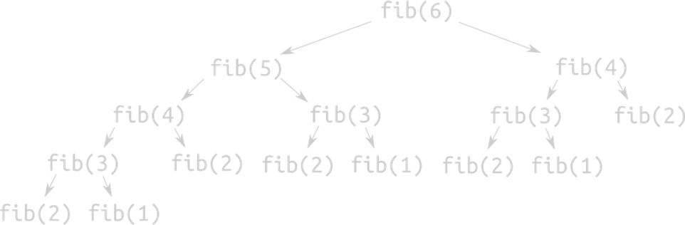

# Тема №17. Динамическое программирование 🐱

**Динамическое программирование** — это когда у нас есть задача, которую непонятно как решать, и мы разбиваем ее на меньшие задачи, которые тоже непонятно как решать.

Метод динамического программирования, который иногда называют **методом динамической оптимизации** - это подход к решению сложных задач путем разбиения их на более мелкие части и запоминания результатов решения этих частей.

<div align="center">
  
</div>

Динамическое программирование позволяет нам избежать повторений, путем запоминания промежуточных результатов. То есть путем запоминания результатов проблем, которые мы уже решили.

Динамическое программирования является комбинацией двух подходов: 
- алгоритма разделяй и властвуй (`divide and conquer algorithm`) 
- жадного алгоритма (`greedy algorithm`).

На алгоритм разделяй и властвуй похоже тем, что мы разбиваем задачу на более мелкие части. Хотя в динамическом программировании мелкие задачи пересекаются, дополняют друг друга.

На жадный алгоритм похоже тем, что мы также сразу ищем оптимальное решение. Правда не всей задачи целиком, а отдельных подзадач. Другими словами, мы не пересчитываем решения подзадач.

Рассмотрим такую задачу: найти `N`-е число Фибоначчи.

**Числа Фибоначчи:** `0` `1` `1` `2` `3` `5` `8` `13` `21` ...
Первые два числа `0` и `1`, а каждое последующее число равно сумме двух предыдущих чисел.

**Эту задачу можно решить рекурсивно:**

```cpp
int Fibonacci(const int n) {
    if (n < 0) {
        return -1;  
    } else if (n <= 1) {
        return n;   
    } else {
        return Fibonacci(n - 1) + Fibonacci(n - 2);
    }
}
```

Однако это будет работать **очень долго**. `20`-е число посчитать еще можно будет, а `40`-е число - нет. И не потому, что числа большие. А потому, что мы будем делать слишком много лишней работы. Число операций будет **экспоненциально** относительно `N`.

Почему? Потому что, чтобы посчитать `N`-е число, нам нужно будет независимо посчитать `(N-1)`-е число и `(N-2)`-е число, и это в минимум в два раза больше действий, чем нужно для `(N-2)`. А значит, для подсчета `N`-го числа Фибоначчи необходимо `2` раза посчитать `(N-2)`-е число, и это занимает в два раза больше времени, а значит это хотя бы `2^(𝑛\2)` действий.

Это ну слишком долго, и главное, что это легко исправляется. Давайте просто не считать лишних действий - если мы один раз посчитали `F𝑘`, то давайте запомним, чему оно равно, и в следующий раз, когда оно нам понадобится, мы используем его сразу. Удобнее всего сохранить числа Фибоначчи прямо в массиве.

<div align="center">
  
</div>

Как видите, для подсчёта `fib(6)` функцию `fib` пришлось вызвать `15` раз, хотя логично, что хватило бы шести. Вся проблема заключается в том, что для некоторых `x` функция `fib(x)` будет вызываться больше одного раза, и каждый раз высчитываться рекурсивно заново. Очевидно, что для оптимальной работы значения функции нужно сохранять для последующего использования. **ДП** - один из способов такой оптимизации.

Существует два основных подхода в динамическом программировании:
- Мемоизация (ленивая динамика);
- Табулация.

## 🐣 Мемоизация

**Мемоизация** (заполнения кеша сверху-вниз) является техникой кеширования, которая использует заново ранее вычисленные решения подзадач. Функция Фибоначчи с использованием техники мемоизации выглядела бы так:

```cpp
#include <iostream>
#include <vector>
using namespace std;

int MemFibonacci(const int n, vector<int>& mem) {
    if (n < 0) {
        return -1;
    }
    
    if (mem[n] != -1) {
        return mem[n]; 
    }
    
    if (n < 2) {
        mem[n] = n;
    } else {
        mem[n] = MemFibonacci(n - 1, mem) + MemFibonacci(n - 2, mem);
    }
    
    return mem[n];
}

int main() {
    const int n = 40;
    vector<int> mem(n + 1, -1);
    
    cout << MemFibonacci(n, mem) << endl;
    
    return 0;
}
```

## 🐳 Табуляция

**Табуляция** (заполнение кеша снизу-вверх) является схожей техникой, но которая в первую очередь сфокусирована на заполнении кеша, а не на поиске решения подпроблемы. 

Вычисление значений, которые необходимо поместить в кеш легче всего в данном случае выполнять итеративно, а не рекурсивно. Функция Фибоначчи с использованием техники табуляции выглядела бы так:

```cpp
#include <iostream>
#include <vector>
using namespace std;

int TabFibonacci(const int n) {
    if (n < 0) {
        return -1;
    }
    
    if (n < 2) {
        return n;
    }
    
    vector<int> dp(n + 1);
    
    dp[0] = 0;
    dp[1] = 1;
    
    for (int i = 2; i <= n; ++i) {
        dp[i] = dp[i - 1] + dp[i - 2];
    }
    
    return dp[n];
}

int main() {
    const int n = 40;
    int result = TabFibonacci(n);
    
    if (result != -1) {
        cout << "F(" << n << ") = " << result << endl;
    } else {
        cout << "Ошибка: отрицательный индекс!" << endl;
    }
    
    return 0;
}
```

Используем константную память `O(1)`:

```cpp
#include <iostream>
using namespace std;

int MemConstFibonacci(const int n) {
    if (n < 0) {
        return -1;
    }

    if (n < 2) {
        return n;
    }
    
    int prev = 0;      // F(i-2), начинаем с F(0)
    int current = 1;   // F(i-1), начинаем с F(1)
    int next = 0;      // F(i)
    
    for (int i = 2; i <= n; ++i) {
        next = prev + current;  // F(i) = F(i-2) + F(i-1)
        prev = current; 
        current = next;
    }
    
    return current;  
}

int main() {
    const int n = 40;
    int result = MemConstFibonacci(n);
    
    if (result != -1) {
        cout << "F(" << n << ") = " << result << endl;
    } else {
        cout << "Ошибка: отрицательный индекс!" << endl;
    }
    
    return 0;
}
```

Это и называется **динамическим программированием** (или динамикой, ДП). Основная идея состоит в том, чтобы

- Свести задачу для `N` к задаче для чисел, меньших, чем `N`(с помощью формулы); 
- хранить все ответы в массиве;
- заполнить начало массива вручную (для которых формула не работает);
- обойти массив и заполнить ответы по формуле;
- вывести ответ откуда-то из этого массива.

## ♟️ Задача с 8 ферзями

Задача о `8` ферзях имеет своим единственным условием задание расставить на стандартной шахматной доске (`64` клетки, `8х8`) `8` фигур – ферзей, (или королев, если угодно), таким образом, чтоб ни одна из них не была под боем другой.

Всего оригинальных решений `12`. Общее количество возможных (с учетом применения операции симметрии) вариантов – `92`. Первым опубликовал ответ на эту задачу в 1850 г. Франц Нак. С тех пор многие ученые решали и исследовали эту задачу, предлагая собственные варианты решения.

```cpp
#include <iostream>
using namespace std;

const int SIZE = 8;
int board[SIZE][SIZE];
int results_count = 0; 

void showBoard()
{
    for (int a = 0; a < SIZE; ++a)
    {
        for (int b = 0; b < SIZE; ++b)
        {
            cout << ((board[a][b]) ? "Q " : ". ");
        }
        cout << '\n';
    }
}

// Функция tryQueen() - проверяет нет ли уже установленных ферзей,
// по вертикали, диагонали.
bool tryQueen(int a, int b)
{
    for (int i = 0; i < a; ++i)
    {
        if (board[i][b])
        {
            return false;
        }
    }
    
    for (int i = 1; i <= a && b - i >= 0; ++i)
    {
        if (board[a - i][b - i])
        {
            return false;
        }
    }
    
    for (int i = 1; i <= a && b + i < SIZE; i++)
    {
        if (board[a - i][b + i])
        {
            return false;
        }
    }
    
    return true;
}

// Функция setQueen() - пробует найти результаты решений.
void setQueen(int a) 
{
    if (a == SIZE)
    {
        showBoard();
        cout << "Result #" << ++results_count << "\n\n";
        return;
    }

    for (int i = 0; i < SIZE; ++i)
    {
        if (tryQueen(a, i))
        {
            board[a][i] = 1;
            setQueen(a + 1);
            board[a][i] = 0;
        }
    }
}

int main()
{
    setQueen(0);
    return 0;
}
```

## 📌 Задачи для практики

### 🧩 Задача 1. Подъем по ступенькам

Реализуйте алгоритм, который вычисляет количество способов подняться на `n` ступенек, если можно делать шаги размером `1` или `2`.

**Требования:**

- Используйте динамическое программирование или математическую формулу.
- Сложность решения должна быть не хуже `O(n)`.

**Ожидаемый результат:**

Функция `int countWays(int n)` возвращает число способов.

---

### 🧩 Задача 2. Заполнение плиткой прямоугольника `2 × n`

Напишите функцию, которая вычисляет количество способов замостить прямоугольник размером `2 × n` плитками `1 × 2` и `2 × 1`.

**Требования:**

- Решение должно использовать рекурсию с мемоизацией или DP.
- Сложность — `O(n)`.

**Ожидаемый результат:**

Функция `long long tileCount(int n)` возвращает число вариантов.

---

### 🧩 Задача 3. Размещение `n` ферзей на шахматной доске `n × n`

Реализуйте алгоритм для нахождения количества способов разместить `n` ферзей на доске `n × n` так, чтобы они не били друг друга.

**Требования:**

- Можно использовать backtracking или оптимизированные битовые маски.
- Время выполнения должно быть приемлемым для `n ≤ 14`.

**Ожидаемый результат:**

Функция `int solveNQueens(int n)` возвращает число валидных конфигураций.

---

### 🧩 Задача 4. Минимальное количество операций для сортировки массива

Напишите программу, которая определяет минимальное количество операций для сортировки массива.
Операция — перестановка двух элементов.

**Требования:**

- Используйте анализ циклов в перестановке.
- Сложность — `O(n log n)`.

**Ожидаемый результат:**

Функция `int minOperationsToSort(vector<int>& a).`

---

### 🧩 Задача 5. Минимальное количество шагов до позиции на числовой прямой

Реализуйте функцию для нахождения минимального количества шагов, чтобы достичь позиции `target` на числовой прямой, если каждый шаг может иметь ограниченную длину (например, от `1` до `k`).

**Требования:**

- Учесть абсолютное значение цели.
- Применить `BFS` или математический расчёт сумм шагов.
- Сложность — не хуже `O(k)`.

**Ожидаемый результат:**
Функция `int minSteps(int target, int k)`.

---

## 📌 Задачи для закрепление изученного материала

### 🧩 Задача 1. 

Застройщикам надоело выдумывать цены на квартиры в Новой Москве из головы, а потому попросили вас написать программу, которая быстро будет возводить число в заданную степень (например, `10^12 = 1000000000000` "сто тыщ мильонов").

Напишите ФУНКЦИЮ быстрого возведения в степень. Количество действий должно быть пропорционально двоичному логарифму `n`.

### 🧩 Задача 2. 

Айрат впервые приехал в Москву и решил пойти поесть в Сабвэй. Заказал себе к сабу дня всевозможные добавки (всего `N` ингредиентов), получил заказ, но понял следующее:

- У него всего `3` салфетки на него одного.
- Ему необходимо перебрать каждый ингредиент, чтобы проверить, можно ему его есть или нет.
- Он хочет собрать свой саб заново на любой салфетке (так сложилось).

Все ингредиенты расположены строго по убыванию размера снизу вверх. Большой ингредиент на маленький класть нельзя, чтобы бутерброд не развалился. Требуется написать программу, которая поможет Айрату переложить все ингредиенты по одному на ТРЕТЬЮ салфетку. 

**Формат ввода:**

```bash
2
```

**Формат вывода:**

```bash
Ingredient 1 move from 1 to 2
Ingredient 2 move from 1 to 3
Ingredient 1 move from 2 to 3
```

**Примечания:**

- Вводится 1 число `n`.
- Необходимо вывести последовательность перекладываний в формате `"Ingredient 1 move from 1 to 2"` (ингредиент `1` переложить c салфетки `1` на салфетку `2`), печатая по одной инструкции в строке.
- Ингредиенты пронумерованы числами от `1` до `n` в порядке возрастания размеров.

---

<div align="center"> Made with ❤️ by <b>dv0retsky</b> </div>