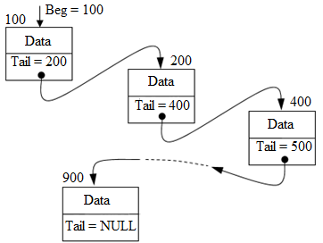
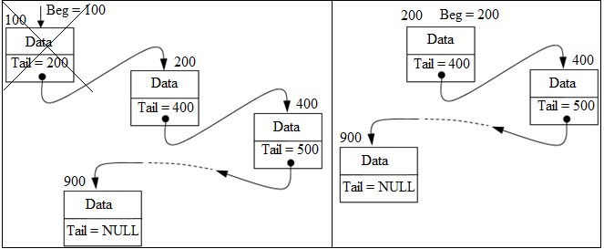
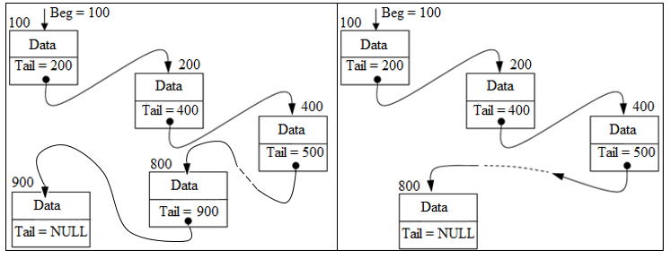
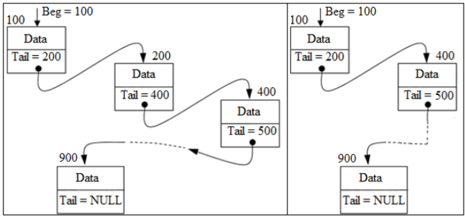
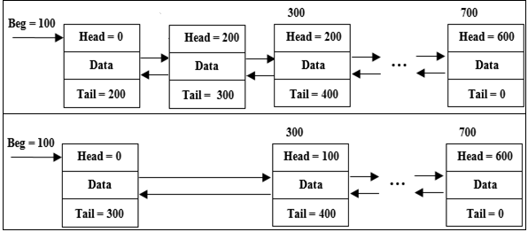
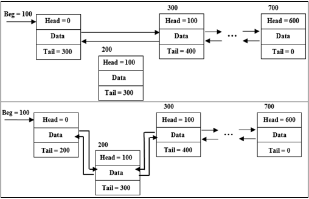

# Тема №19. Односвязные и двусвязные линейные списки ☑️

<div align="center">
  
</div>

## ⭐️ Односвязные линейные списки

Одномерный однонаправленный список представляет собой совокупность отдельных элементов, каждый из которых содержит две части – информационную (`Data`) и адресную (`Tail`).

Информационная часть предназначена для хранения полезных данных и может иметь практически любой тип. Адресная часть каждого элемента содержит адрес следующего элемента списка.

<div align="center">
  
</div>

Для работы со списком достаточно знать только адрес его первого элемента (`Beg`). Зная адрес первого элемента списка можно последовательно получить доступ к любому другому его элементу.

Поскольку каждый элемент списка должен иметь две части, логичнее всего представить его в виде следующей структуры:

```cpp
struct List
{
   int data;
   List *tail;
};
```

Типовыми операциями при работе со списками являются:

1. создание списка;
2. освобождение памяти от списка (удаление списка);
3. доступ к заданному элементу списка для манипуляций с его информационной частью;
4. добавление нового элемента к списку;
5. удаление элемента из списка;
6. перестановка элемента списка на новую позицию внутри списка.

Достоинством подобных структур является простота добавления, удаления и перестановки элементов списка, которые осуществляются путем манипуляций с адресными частями без перезаписи всего списка.

## 🚀 Создание списка

Представленная ниже функция `createList` обеспечивает создание динамического однонаправленного списка на `length` элементов и возвращает адрес первого элемента созданного списка.

```cpp
List *createList(int length)
{
    List *curr = 0,     // Адрес очередного элемента списка
         *next = 0;     // Адрес следующего за очередным элемента списка
    // Начинаем создавать список с последнего элемента
    for (int i = 1; i <= length; ++i) {
        // Создаем очередной элемент списка
        curr = new List;
        // В адресную часть записываем адрес следующего
        // за очередным элемента списка
        curr -> tail = next;
        // Запоминаем адрес очередного элемента в качестве
        // следующего элемента для следующего шага цикла
        next = curr;
    }
    // Возвращаем адрес последнего созданного элемента, 
    // как адрес первого элемента списка
    return curr;
}
```

Для создания списка используется цикл на `length` итераций. На каждом шаге этого цикла в динамической области памяти создается очередной элемент списка с адресом `curr` и в его адресную часть `curr -> adr` записывается адрес следующего за ним элемента `next`. Наиболее простой алгоритм работы этой функции получается в том случае, когда список начинает создаваться не с первого элемента, а с последнего.

Использовать эту функцию для создания списка можно, например, так:

```cpp
List *list = createList ( 5 );
```

Переменная `list` будет содержать адрес первого элемента динамического списка, содержащего **5** элементов. Информационные части элементов этого списка в функции `createList` не инициализируются и будут иметь после выхода из функции непредсказуемые значения.

Заполнить информационные части элементов этого списка конкретными данными, например, с клавиатуры можно так:

```cpp
// Чтобы не потерять адрес начала списка (он нам понадобится для дальнейшей
// работы со списком) вводим дополнительную переменную-указатель curr – адрес 
// очередного элемента списка и делаем его равным адресу первого элемента списка
List * curr = list;
// Выполняем цикл пока адрес очередного элемента списка не равен 0
while ( curr )
{
// Вводим данные в информационную часть очередного элемента с клавиатуры
	cin >> curr -> data; 
// Делаем очередным следующий элемент списка. Для этого переменной
// Curr присваиваем адрес следующего элемента списка. Последний элемент 
// списка содержит в адресной части 0, поэтому кода мы обработаем последний 
// элемент списка, переменная Curr станет равна 0, и цикл закончится
	curr = curr -> tail;
}
```

Вывод значений информационных частей элементов списка на экран делается аналогично:

```cpp
curr = list;
while ( curr )
{
	// Выводим информационную часть очередного элемента на экран
	cout << curr -> data << ' '; 
	curr = curr -> tail;
}
cout << endl;
```

## ❌ Удаление элемента из списка

Если стоит задача удалить первый элемент связного списка, необходимо изменить адрес первого элемента списка на адрес следующего за первым элемента и освободить динамическую память от первого элемента.

<div align="center">
  
</div>

Схожий принцип действия и у удаления последнего элемента:

<div align="center">
  
</div>

Сначала необходимо изменить адресную часть  элемента так, чтобы теперь он имел нулевой указатель, затем нужно освободить память от N-го элемента.

С удалением элемента из середины списка дело обстоит практически так же, как и с удалением из конца списка.

<div align="center">
  
</div>

```cpp
void delItem( List* &beg, unsigned index )
{
	if (index >= lengthList(beg)) {
                return;
        }
        List *item;
	if ( !index )
	{
		item = beg -> tail;
		delete beg;
		beg = item;
		return;
	}
	item = listItem ( beg, index - 1, 0 );
	List * dItem = item -> tail;
	item -> tail = dItem -> tail;
	delete dItem;
}
```

После окончания работы со списком необходимо освободить от него динамическую память. Для этого можно использовать следующую функцию, имеющую единственный параметр-ссылку `beg` – адрес начала списка:

```cpp
void deleteList ( List* &beg )
{
	List *next;  // Указатель на следующий элемент списка
	// Начинаем с начала списка
	while ( beg )
	{
		// Запоминаем адрес следующего элемента списка. Если этого не сделать,
		// то после удаления элемента по адресу Beg негде будет взять адрес
		// следующего элемента списка 
		bext = beg -> tail;
		// Удаляем первый элемент списка
		delete beg;
// Делаем адрес первого элемента списка равным адресу 
// следующего после удаленного (мы его запомнили чуть выше)
		beg = next;
	}
}
```

После окончания работы эта функция возвращает через свой параметр-ссылку `beg` адрес `0` – список отсутствует (он перестал существовать). Если проверить значение указателя `list` после вызова этой функции, то оно действительно будет равно `0`, что будет свидетельствовать о том, что список не существует.

## 🍭 Действия над элементами односвязного линейного списка

Доступ к заданному элементу списка:

Функция `listItem` возвращает адрес элемента списка с индексом `index` (индексация элементов в списке начинается с `0`). Если элемент с заданным индексом в списке отсутствует, функция возвращает нулевой адрес. Параметр `beg` задает адрес первого элемента списка (адрес начала списка). Третий параметр функции `errMsg` определяет надо ли выводить сообщение об ошибке при неправильно заданном индексе.

```cpp
List *listItem(List *beg, int index, bool errMsg = true)
{
	//  Цикл заканчивается, когда 
	while (beg && (index--))
		beg = beg -> tail;
	if (errMsg && !beg)
		cout << "Элемент списка отсутствует \n";
	return beg;
}
```

Определение количества элементов в списке:

```cpp
unsigned lengthList(List *beg)
{
	int length = 0;   //  Счетчик элементов списка
	// Начинаем с начала списка
	while (beg)
	{
		// Увеличиваем счетчик элементов списка на единицу
		++length;
		// Перемещаемся на следующий элемент списка
		beg = beg->adr;
	}
	return length;
}
```

## 📌 Задачи для закрепление изученного материала

### 🧩 Задача 1. 

Опишите структуру связного однонаправленного списка:

```cpp
struct list
{
	int data;
	list *tail;
};
```

Напишите программу, содержащую функции создания списка, добавления нового элемента к сортирующему списку (элементы располагаются в отсортированном порядке от меньшего к большему) и вывода всех элементов списка на экран.

Сначала пользователь вводит число - количество элементов, затем вводит элементы для вставки (элементы необходимо вставлять в список сразу после ввода). Если ввод данных некорректен - `"Invalid input"`.

Затем на экран необходимо вывести список. Если в списке нет элементов - `"The list is empty"`.

**Формат ввода:**

```bash
20
611 325 31 867 12 -7 845 703 177 739 873 176 116 770 242 646 674 457 743 743
```

**Формат вывода:**

```bash
-7 12 31 116 176 177 242 325 457 611 646 674 703 739 743 743 770 845 867 873
```

---

### 🧩 Задача 2.

Напишите программу, содержащую функции создания списка, добавления нового элемента и поиск элемента в списке по значению.

Сначала пользователь вводит число - количество элементов, затем вводит элементы для вставки (элементы необходимо вставлять в список сразу после ввода). Если ввод данных некорректен - `"Invalid input"`.

Затем пользователь вводит число. Если число было найдено, необходимо вывести `"List item found"`, иначе - `"List item not found"`. Если в списке нет элементов необходимо вывести `"The list is empty"`.

**Формат ввода:**

```bash
14
241 -28 712 544 432 264 735 584 460 161 350 58 441 -85
460
```

**Формат вывода:**

```bash
List item found
```

---

### 🧩 Задача 3. 

Напишите программу, содержащую функции создания списка, добавления нового элемента и удаления элемента в списке по значению.

Сначала пользователь вводит число - количество элементов, затем вводит элементы для вставки (элементы необходимо вставлять в список сразу после ввода). Если ввод данных некорректен - `"Invalid input"`.

Затем пользователь вводит число. Если число было найдено, необходимо удалить его и вывести `"List item deleted"`, иначе - `"List item not found"`. Затем необходимо вывести список на экран. Если в списке нет элементов необходимо вывести `"The list is empty"`. 

**Формат ввода:**

```bash
14
241 -28 712 544 432 460 264 735 584 161 350 58 441 -85
460
```

**Формат вывода:**

```bash
List item deleted
241 -28 712 544 432 264 735 584 161 350 58 441 -85
```

---

### 🧩 Задача 4.

Напишите программу, содержащую функции создания списка, добавления нового элемента к списку, сортировки элементов списка `bubble-sort` и вывода всех элементов списка на экран.

Сначала пользователь вводит число - количество элементов, затем вводит элементы для вставки (элементы необходимо вставлять в список сразу после ввода). Если ввод данных некорректен - `"Invalid input"`.

Затем элементы списка сортируются и на экран необходимо вывести отсортированный список. Если в списке нет элементов - `"The list is empty"`.

**Формат ввода:**

```bash
20
611 325 31 867 12 -7 845 703 177 739 873 176 116 770 242 646 674 457 743 743
```

**Формат вывода:**

```bash
List item deleted
-7 12 31 116 176 177 242 325 457 611 646 674 703 739 743 743 770 845 867 873
```

---

## 🍍 Двусвязные линейные списки

<div align="center">
  
</div>

Одним из недостатков односвязных списков является то, что узел (элемент списка) имеет указатель только на следующий элемент. Вернуться из текущего элемента к предыдущему явным способом невозможно.

Каждый узел двусвязного (двунаправленного) линейного списка содержит два поля указателей – на следующий и на предыдущий узлы. Указатель на предыдущий узел корня списка содержит нулевое значение. Указатель последнего узла также содержит нулевое значение.

Поскольку каждый элемент списка должен иметь три части, логичнее всего представить его в виде следующей структуры:

```cpp
struct List
{
	int data;
	List *head;
	List *tail;
};
```

<div align="center">
  
</div>

 Поле `Head` содержит адрес предыдущего элемента, поле `Tail` содержит адрес следующего элемента списка. Такая организация списка позволяет перемещаться по его элементам в двух направлениях.

 Основные действия, производимые над узлами **двусвязного линейного списка (ДЛС)**:

1. инициализация списка;
2. добавление узла в список;
3. удаление узла из списка;
4. удаление корня списка;
5. вывод элементов списка;
6. вывод элементов списка в обратном порядке;
7. взаимообмен двух узлов списка.

Порядок действия очень похож на односвязный линейный список, но необходимо учитывать, что в двусвязном списке имеется два указателя: на следующий и предыдущий элементы.

### 🎀 Создание двусвязного списка

Для создания такого списка можно использовать следующую функцию:

```cpp
List *createList(int length)
{
    List *curr = 0,     // Адрес очередного элемента списка
         *next = 0;      // Адрес следующего за очередным элемента списка
    // Начинаем создавать список с последнего элемента
    for (int i = 1; i <= length; ++i)
    {
        // Создаем очередной элемент списка
        curr = new List;
        // В адресную часть записываем адрес следующего
        // за очередным элемента списка
        curr -> tail = next;
        if (next)   //  Следующий элемент существует (Next не равен 0)
            //  Очередной элемент с адресом Curr является предыдущим 
            //  элементом для элемента с адресом Next
            next -> head = curr;
        // Запоминаем адрес очередного элемента в качестве
        // следующего элемента для следующего шага цикла
        next = curr;
    }
    //  Для первого элемента списка адрес предыдущего элемента
    //  должен быть равен 0
    curr -> head = 0;
    // Возвращаем адрес последнего созданного элемента, 
    // как адрес первого элемента списка
    return curr;
}
```

### ❌ Удаление элементов двусвязного списка

Удаление первого элемента и последнего элемента практически аналогично удалению элемента из односвязного списка. Нужно изменить значение указателя на первый элемент, обнулить значение указателя головы/хвоста, освободить динамическую память.

С удалением элемента из середины списка дело обстоит сложнее: необходимо проделать аналогичные операции по отношению к двум узлам, а не к одному.

<div align="center">
  
</div>

Для удаления узла из середины списка, необходимо изменить указатели `head` и `tail` предыдущего и следующего элементов, связав их вместе. Затем нужно освободить динамическую память от удаленного элемента.

```cpp
void delItem(List * &beg, int Index)
{
    if(index >= lengthList(beg)) {
        return;
    }

    List* item;
    if (!index) {
        item = beg -> tail;
        delete beg;
        beg = item;
        beg -> head = null;
        return;
    }
    item = listItem(beg, index - 1, 0);
    List* dItem = item -> tail;
    item -> tail = dItem -> tail;
    item -> tail -> head = item;
    delete dItem;
}
```

### ➡️ Вставка узла

Вставка нового узла в двусвязный линейный список проводится аналогично. Также присутствует три ситуации: вставка нового корня, вставка последним элементом и вставка узла в середину списка.

<div align="center">
  
</div>

Вставка нового корневого узла отличается от удаления тем, что необходимо изменить `head`-указатель прошлого корневого узла, указатель на корневой узел и правильно связать новый узел со списком.

Вставка узла в конец списка не должна вызывать затруднений: необходимо изменить `tail`-указатель прежнего последнего элемента на адрес нового узла, затем правильно связать новый узел с двусвязным списком (`head` – адрес на предыдущий элемент, `tail` – NULL-указатель).

```cpp
List* insItem( List* &beg, int index )
{
    List * item = new List;
    if (!index || !beg) {
        beg -> head = item;
        item -> head = null;
        item -> tail = beg;
        beg = item;
        return item;
    }
    List* predItem = beg;
    --index;
    while (predItem -> tail && (index--)) {
        predItem = predItem -> tail; 
    }
    item -> head = predItem;
    item -> tail -> head = item;
    item -> tail = predItem -> tail;
    predItem -> tail = item;
    return item;
}
```

### 🔁 Обмен элементов местами

Больше всего трудностей может возникнуть именно с взаимообменом элементов двусвязного списка. Главная проблема – возможная путаница в указателях. Нужно правильно изменить указатели всех затрагиваемых узлов.

<div align="center">
  
</div>

Видно, сколько необходимо изменить адресов указателей, чтобы двумерный список работал корректно. Если хоть один указатель будет ссылаться неправильно, то список будет работать некорректно и может вовсе зациклиться. Причем программист этого может не заметить, если поле `data` однородно или вовсе отсутствует. Поэтому (как и с любыми указателями) нужно быть внимательным.

## 📌 Задачи для закрепление изученного материала

### 🧩 Задача 1. 

Опишите структуру двусвязного списка:

```cpp
struct list
{
	int data;
	list *head;
	list *tail;
};
```

Напишите программу, содержащую функции создания двусвязного списка, добавления нового элемента к сортирующему списку (элементы располагаются в отсортированном порядке от большего к меньшему) и вывода всех элементов списка на экран.

Сначала пользователь вводит число - количество элементов, затем вводит элементы для вставки (элементы необходимо вставлять в список сразу после ввода). Если ввод данных некорректен - `"Invalid input"`.

Затем на экран необходимо вывести список. Если в списке нет элементов - `"The list is empty"`.

**Формат ввода:**

```bash
20
611 325 31 867 12 -7 845 703 177 739 873 176 116 770 242 646 674 457 743 743
```

**Формат вывода:**

```bash
-7 12 31 116 176 177 242 325 457 611 646 674 703 739 743 743 770 845 867 873
```

---

### 🧩 Задача 2.

Напишите программу, содержащую функции создания двусвязного списка, добавления нового элемента к списку  и вывода всех элементов списка на экран в обратном порядке.

Сначала пользователь вводит число - количество элементов, затем вводит элементы для вставки (элементы необходимо вставлять в список сразу после ввода). Если ввод данных некорректен - `"Invalid input"`.

Затем на экран необходимо вывести список в обратном порядке. Если в списке нет элементов - `"The list is empty"`.

**Формат ввода:**

```bash
9
9 8 7 6 5 4 3 2 1
```

**Формат вывода:**

```bash
1 2 3 4 5 6 7 8 9
```

---

### 🧩 Задача 3.

Напишите программу, содержащую функции создания двусвязного списка, добавления нового элемента и удаление элемента в списке по значению.

Сначала пользователь вводит число - количество элементов, затем вводит элементы для вставки (элементы необходимо вставлять в список сразу после ввода). Если ввод данных некорректен - `"Invalid input"`.

Затем пользователь вводит число. Если число было найдено, необходимо вывести `"List item deleted"`, иначе - `"List item not found"`. Затем необходимо вывести все элементы списка. Если в списке нет элементов необходимо вывести `"The list is empty"`.

**Формат ввода:**

```bash
14
241 -28 712 544 432 460 264 735 584 161 350 58 441 -85
460
```

**Формат вывода:**

```bash
List item deleted
241 -28 712 544 432 264 735 584 161 350 58 441 -85
```

---

### 🧩 Задача 4.

Напишите программу, содержащую функции создания двусвязного списка, добавления нового элемента и обмен элементов местами.

Сначала пользователь вводит число - количество элементов, затем вводит элементы для вставки (элементы необходимо вставлять в список сразу после ввода). Если ввод данных некорректен - `"Invalid input"`.

Затем пользователь вводит два числа - номер первого элемента и номер второго элемента, которые нужно поменять местами. Если элемента с таким номером не существует, необходимо вывести `"List item not found"`. Иначе необходимо обменять элементы местами и вывести список на экран. Если в списке нет элементов необходимо вывести `"The list is empty"`.

> **Важно: изменять нужно не значения элементов, а именно элементы!**

**Формат ввода:**

```bash
14
241 -28 712 544 432 460 264 735 584 161 350 58 441 -85
1 2
```

**Формат вывода:**

```bash
-28 241 712 544 432 460 264 735 584 161 350 58 441 -85
```

---

<div align="center"> Made with ❤️ by <b>dv0retsky</b> </div>