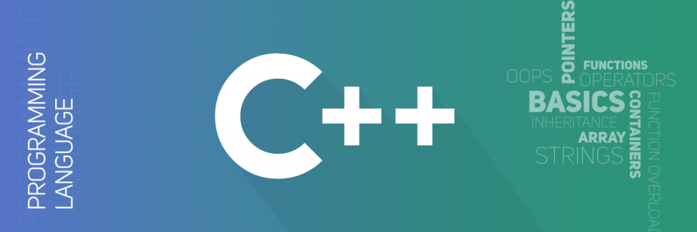

# Тема №1. Введение в C++ 🦋

Сегодня мы поговорим об одном из самых популярных языков программирования - **C++**. Мы обсудим его историю, основные принципы программирования на **C++** и даже немного поговорим о том, почему люди так часто используют именно этот язык.

  

## 🍌 История и развитие языка C++

**C++** был создан в 1983 году **Бьёрном Страуструпом** в качестве расширения языка программирования **C**. Его первоначальная цель заключалась в том, чтобы сделать **C** более гибким и мощным языком, добавив возможности *объектно-ориентированного программирования.*

В следующие годы язык **C++** продолжал развиваться и улучшаться. В 1998 году был выпущен стандарт `C++98`, который стал основой для всех последующих версий языка. В последующие годы были выпущены стандарты `C++03`, `C++11`, `C++14`, `C++17` и, наконец, `C++20`. Каждый новый стандарт добавлял новые возможности и улучшения в язык, делая его более мощным и удобным в использовании!

## 🐝 Основные принципы программирования на C++

**C++** является многопарадигмальным языком программирования, что означает, что он позволяет использовать несколько различных стилей программирования. Но объектно-ориентированное программирование является одним из основных стилей, на котором основан **C++**.

Основные принципы объектно-ориентированного программирования в **C++** включают следующее:

1. **Наследование:** это позволяет создавать новые классы на основе уже существующих классов, наследуя их свойства и методы.

2. **Инкапсуляция:** это позволяет объединять данные и методы в классе и скрывать их от других частей программы, что улучшает безопасность и надежность программы.

3. **Полиморфизм:** это позволяет создавать методы с одинаковым именем, но разным поведением, в зависимости от того, какой объект вызывает этот метод.

Кроме того, **C++** также поддерживает другие стили программирования, такие как процедурное программирование и обобщенное программирование.

---

Чтобы исходный код программы на **C++** превратился в исполняемый файл для конкретной архитектуры процессора, программу нужно скомпилировать. Существует несколько популярных компиляторов **C++**:

- [GNU Compiler Collection](https://en.wikipedia.org/wiki/GNU_Compiler_Collection) (GCC);
- [Clang](https://en.wikipedia.org/wiki/Clang) — построен поверх инфраструктуры LLVM;
- [Microsoft Visual C++](https://en.wikipedia.org/wiki/Microsoft_Visual_C%2B%2B) (MSVC) — входит в состав Microsoft Visual Studio;

При изучении вам будут полезны следующие англоязычные ресурсы:

- [cppreference.com](https://en.cppreference.com/) — онлайн-документация по **C++**;
- [isocpp.org](https://isocpp.org/) — сайт **Standard C++ Foundation**;
- [C++ Core Guidelines](https://isocpp.github.io/CppCoreGuidelines/CppCoreGuidelines.html) — гайдлайны по **C++** от Бьярне Страуструпа и Герба Саттера;
- [learncpp.com](https://www.learncpp.com/) — современный учебник по **C++**;
- [hacking C++](https://hackingcpp.com/index.html) — наглядный справочник по **C++** с картинками и инфографикой.

## 🌻 Почему люди используют C++

Существует множество причин, по которым люди используют **C++** для разработки программного обеспечения. Вот некоторые из них:

1. **Высокая производительность:** C++ является компилируемым языком программирования, что означает, что программа, написанная на C++, компилируется в нативный машинный код, что обеспечивает быстрое выполнение программы.

2. **Близость к аппаратуре:** C++ является близким к аппаратуре языком программирования, что означает, что программист может точно управлять памятью и процессором, что позволяет создавать высокоэффективный код.

3. **Поддержка объектно-ориентированного программирования:** **C++** поддерживает объектно-ориентированное программирование, что делает его очень удобным для создания больших проектов с множеством классов и объектов.

4. **Кроссплатформенность:** **C++** можно использовать для создания программного обеспечения, работающего на различных платформах, таких как Windows, Linux, Mac и т. д.

5. **Обилие библиотек:** **C++** имеет обширную коллекцию библиотек, которые позволяют программистам быстро создавать программы, не затрачивая много времени на написание кода с нуля.

6. **Распространенность:** **C++** является одним из самых популярных языков программирования в мире, поэтому многие программисты знакомы с ним и могут легко обмениваться знаниями и опытом.

## ⚡ В заключение

 **C++** является очень мощным и гибким языком программирования, который может использоваться для создания широкого спектра приложений, от игр до приложений для научных исследований. Если вы только начинаете изучать программирование, **C++** может быть немного сложным языком, но учить его может быть очень полезно для вашей карьеры в **IT-сфере**!

---

 Made with ❤️ by <b>dv0retsky</b> 
