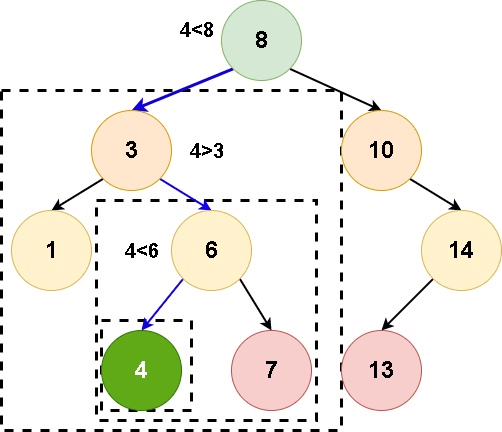
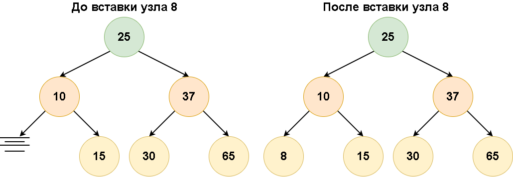
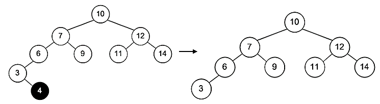
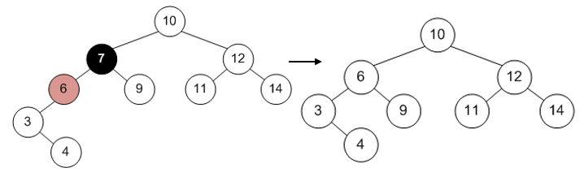
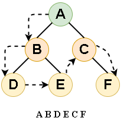
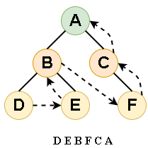

# Тема №20. Бинарное дерево 🎄

**Бинарное дерево** – это динамическая структура данных, состоящая из узлов, каждый из которых содержит кроме данных не более двух ссылок на различные бинарные деревья. На каждый узел имеется ровно одна ссылка. Начальный узел называется корнем дерева.

Узел, не имеющий поддеревьев, называется листом. Исходящие узлы называются предками, входящие – потомками. Высота дерева определяется количеством уровней, на которых располагаются его узлы.

<div align="center">
  
</div>

Дерево является рекурсивной структурой данных, поскольку каждое поддерево также является деревом. Действия с такими структурами лучше всего описывать с помощью рекурсивных алгоритмов.

**Бинарные дерева нужны:**
- Если необходимо расположить информацию, связанную между собой некой иерархией. Примером является файловая система компьютера.
- Если необходимо хранить данные, составленные в виде определённой структуры. Тогда хранение в виде бинарного дерева позволяет уменьшить скорость поиска данных и доступа к хранимой информации.
- Если необходима высокая скорость добавления или удаления данных.
- Если заранее неизвестен хранимый объем данных. Бинарные деревья, также, как и связанные списки, не имеют ограничения на количество узлов, поскольку узлы связаны указателями.

## 🦖 Понятие бинарного дерева поиска

**Бинарное дерево поиска** – бинарное дерево, которое обладает дополнительными свойствами. Если дерево организовано таким образом, что для каждого узла все ключи левого поддерева меньше ключа этого узла, а все ключи его правого поддерева больше, то его можно называть бинарным деревом поиска.

Иными словами, данные в бинарном дереве поиска хранятся в отсортированном виде. Одинаковые ключи не допускаются.

<div align="center">
  
</div>

При каждой операции вставки нового или удаления существующего узла отсортированный порядок дерева сохраняется. При поиске элемента сравнивается искомое значение с корнем.

Если искомое значение больше корня, то поиск продолжается в правом потомке корня, если меньше, то в левом, если равно, то значение найдено и поиск прекращается.

Поскольку каждый корень дерева должен иметь три части, логичнее всего представить его в виде следующей рекурсивной структуры:

```cpp
struct Node
{
    int key;       //ключ – значение узла, типа int
    Node* left;    //указатель на левого потомка
    Node* right;   //указатель на правого потомка
};
```

**Сбалансированное бинарное дерево поиска** – это бинарное дерево поиска с логарифмической высотой.

Для данного случая это правило необязательно, в отличие от AVL или красно-черных деревьев, где строгое определение оперирует разницей глубины самого глубоко и самого неглубокого листа и отношением глубины самого глубоко и самого неглубокого листа соответственно.

Сбалансированное бинарное дерево поиска применяется, когда необходимо осуществлять быстрый поиск элементов, чередующийся со вставками новых элементов и удалением существующих.

## 🌵 Поиск элемента с заданным ключом

Для поиска элемента в бинарном дереве поиска можно воспользоваться функцией, которая принимает в качестве параметра заданное значение ключа. Для каждого узла функция сравнивает значение его ключа со значением заданного ключа. 

Если значения ключей одинаковы, то функция возвращает текущий узел. В противном случае, функция вызывается рекурсивно: для левого поддерева, если заданный ключ меньше ключа узла, для правого поддерева, если заданный ключ больше ключа узла.

<div align="center">
  
</div>

 Функция вставки нового элемента в дерево:

 ```cpp
 Node* search(int key, Node* root)              //(ключевое значение, указатель ну узел)
{
    if (root!= NULL)                          // если узел инициализирован
    {
        if (key == root->key_value)            // и ключевое значение узла совпадает с искомым ключевым значением.  
            return root;                       // возвращается указатель на найденный элемент.
        if (key < root->key_value)             // иначе, если искомое ключевое значение меньше ключевого значения узла
            return search(key, root->left);    // вызывается эта же функция для левого потомка.
        else                                   // иначе
            return search(key, root->right);   // вызывается эта же функция для правого потомка.
    }
    else return NULL;                          // иначе возвращается NULL.
}
```

## 🌴 Вставка нового узла 

При вставке элемента в бинарное дерево поиска необходимо учитывать два случая:

- Дерево пустое;
- Дерево непустое.

Если дерево пустое, то создается новый узел, который добавляется в дерево. Если дерево не пустое, то значение ключа добавляемого элемента сравнивается со значением ключа в узле, начиная от корня. 

Так как одинаковые ключи не допускаются, перед вставкой нового элемент нужно проверить, нет ли уже в бинарном дереве такого элемента. Для этого необходимо начать обход дерева с корневого узла и проверить, не превосходит ли значение корневого узла добавляемого значения.

Если корневой узел больше добавляемого элемента, то необходимо переместиться в левое дочернее дерево. В противном случае – в правое. После выполнения данной проверки можно переходить к добавлению узла в бинарное дерево.

<div align="center">
  
</div>

```cpp
void insert(int key, Node* root) {        // (новое ключевое значение, указатель на текущий узел)                                
    if (key < root->key_value)            // если новое ключевое значение меньше чем ключевое значение в узле
    {
        if (root->root!= NULL)           // и если левый указатель узла инициализирован
            insert(key, root->left);      // функция вызывает саму себя, для левого узла потомка
        else                              // иначе (если левый потомок не инициализирован)
        {
            root->left = new node;        // функция создаст и поместит новый элемент на место левого потомка.
            root->left->key_value = key;  // внесёт новое ключевое значение в элемент.
            root->left->left = NULL;      // установит левый дочерний указатель 
            root->left->right = NULL;     // и правый дочерний указатель в NULL.
        }
    }
    else if (key >= root->key_value)      // иначе, если новое ключевое значение не меньше ключевого значения в узле 
 
        if (root->right != NULL)          // и если правый указатель инициализирован,
            insert(key, root->right);     // то функция вызывает саму себя, для правого потомка
        else                              // иначе(если правый потомок не инициализирован)
        {
            root->right = new node;       // функция создаст и поместит новый элемент на место правого потомка.
            root->right->key_value = key; // внесёт новое ключевое значение в элемент.
            root->right->left = NULL;     // установит левый дочерний указатель
            root->right->right = NULL;    // и правый дочерний указатель в NULL.
        }
    }
}
```

## 🍃 Удаление узла из дерева

С удалением узла дело обстоит немного иначе. Существует несколько возможных ситуаций:

- у узла нет наследников (узел является листом);
- у узла имеется наследник, притом только один;
- у узла есть оба наследника.

Если у узла нет наследника, то необходимо просто удалить этот узел, а у его родителя обнулить указатель на него. Это самая простая ситуация.

<div align="center">
  
</div>

Все слегка усложняется, когда у удаляемого узла имеются наследники.

<div align="center">
  
</div>

Если же у удаляемого два наследника, то узел не удаляется, а его значение заменяется на максимум левого поддерева. После этого удаляется максимум левого поддерева.

<div align="center">
  
</div>

Максимум левого поддерева имеет не более одного наследника, так что он удаляется просто, аналогично ситуации, рассмотренной выше.Функция вставки аналогична функции поиска: необходимо пройти по дереву и вставить узел в нужное место. Для этого следует выбрать левое или правое поддерево корневого узла, а затем рекурсивно перемещаться по выбранному поддереву до тех пор, пока не будет найдена позиция для вставки узла.

Если же необходимо удалить дерево, то необходимо реализовать рекурсивную функцию удаления:

```cpp
void destroyTree(Node *root)
{
      if(root!=NULL)	    	        // если узел дерева существует
      {					// функция вызовет сама себя
          destroyTree(root->left);	// сначала для левого потомка,
          destroyTree(root->right);  	// после для правого потомка.
          delete root;			// если потомков нет, она удалит
      }
}
```

Создание дерева:

```cpp
Tree* getFreeTree(int value) {
	Tree* root = (Tree*)malloc(sizeof(Tree));
	root->left = root->right = NULL;
	root->data = value;
	return root;
}
```

Получение узла с наименьшим значением:

```cpp
Tree* getMinTree(Tree* root) {
	while (root->left) {
		root = root->left;
	}
	return root;
}
```

Получение узла с наибольшим значением:

```cpp
Tree* getMaxTree(Tree* root) {
	while (root->right) {
		root = root->right;
	}
	return root;
}
```

Размерность дерева:

```cpp
void sizeTree(Tree* root) {
	if (root) {
		size_count++;
		sizeTree(root->left);
		sizeTree(root->right);
	}
}
```

Функция вывода дерева:

```cpp
//функция выводит узлы дерева, вызывает функцию вывода связей
void printTree(elem* tree, trunk* prev, bool isRight, ofstream& f2) {
	if (tree == NULL)//пустое дерево
		return;
	string prev_str = "    ";//отступ по уровням (длина как для стрелки)
	trunk* tmp = new trunk(prev, prev_str);//новая связь
	printTree(tree->right, tmp, 1, f2);//правое поддерево
	if (!prev)//если нет предыдущего узла (предка) -> корень дерева
		tmp->str = "-->";//связь корня дерева
	else if (isRight) {//если правое поддерево
		tmp->str = ".-->";//связь правого поддерева
		prev_str = "   |";//в отступ по уровням добавляем черту (дерево идет вширь)
	}
	else {//в противном случае - левое поддерево
		tmp->str = "`-->";//левое поддерево
		prev->str = prev_str;//отступ по уровням не меняется
	}
	int count = 0;//уровень узла
	showTrunk(tmp, count, f2);//выводим связи дерева - стебли
	f2 << tree->val << endl;//выводим значение узла
	if (prev)//задаем строку отступов для узла, если есть поддеревья
		prev->str = prev_str;
	tmp->str = "   |";//в отступ по уровням добавляем черту (дерево идет вширь)
	printTree(tree->left, tmp, 0, f2);//левое поддерево
}

void showTrunk(trunk* p, int &count, ofstream& f2) {//функция вывода связей дерева
	if (p == NULL)//если нет поддеревьев
		return;
	showTrunk(p->prev, count, f2);//выводим предыдущий узел
	count++;//увеличиваем уровень
	f2 << p->str;//выводим отступы и связи
}
```

## 🐉 Обходы дерева

**Граф** – это множество вершин и ребер. Ребро – это связь между двумя вершинами. Количество возможных ребер в графе квадратично зависит от количества вершин (для понимания можно представить турнирную таблицу сыгранных матчей).

**Дерево** – это связный граф без циклов. Связность означает, что из любой вершины в любую другую существует путь по ребрам. Отсутствие циклов означает, что данный путь – единственный.

**Обход графа** – это систематическое посещение всех его вершин по одному разу каждой. Существует два вида обхода графа:

- поиск в глубину;
- поиск в ширину.

Существует множество задач, которые выполняются на структурах данных, представленных в виде бинарного дерева. Одна из самых распространенных – выполнение заданной операции с каждым элементом дерева. Чтобы отредактировать какие-либо элементы дерева, нужно совершить его обход.

Поиск в глубину идет из начальной вершины, посещая еще не посещенные вершины без оглядки на удаленность от начальной вершины. Алгоритм поиска в глубину по своей природе является рекурсивным. Для эмуляции рекурсии в итеративном варианте алгоритма применяется структура данных «стек».

Поиск в ширину идет из начальной вершины, посещает сначала все вершины, находящиеся на расстоянии одного ребра от начальной, потом посещает все вершины на расстоянии двух ребер от начальной и так далее. Алгоритм поиска в ширину является по своей природе нерекурсивным (итеративным). Для его реализации применяется структура данных «очередь» (FIFO).

```cpp
while (q->size != 0) {
	Node *tmp = (Node*)popFront(q);
	std::cout << tmp->data << " ";
	//Если есть левый наследник, то помещаем его в очередь для дальнейшей обработки
	if (tmp->left) {
		pushBack(q, tmp->left);
	}
	//Если есть правый наследник, то помещаем его в очередь для дальнейшей обработки
	if (tmp->right) {
		pushBack(q, tmp->right);
	}
}
```

Обходу в ширину в графе соответствует обход по уровням бинарного дерева. При данном обходе идет посещение узлов по принципам сверху вниз и слева направо. Обходу в глубину в графе соответствуют три вида обходов бинарного дерева: прямой, симметричный и обратный.

## 🍏 Прямой обход - сверху внизу

**Прямой обход** идет в следующем порядке: корень, левый потомок, правый потомок.

<div align="center">
  
</div>

1. Обход начинается с корня дерева – узел `А`;
2. Далее выполняется переход вниз, сначала к левому поддереву;
3. Выполняется переход к левому потомку узла `А` – узел `B`;
4. Выполняется переход к левому потомку узла `В` – узел `D`;
5. Узел `D` является листом, то есть ниже двигаться нет возможности;
6. Выполняется переход к правому потомку узла `В` – узел `E`;
7. Левое поддерево узла `А` полностью пройдено, начинается обход правого поддерева;
8. Выполняется переход к правому потомку узла `А` – узел `С`;
9. Выполняется переход к правому потомку узла `С` – узел `F`, достигнут последний узел дерева, обход завершен.

```cpp
void preOrderTravers(Node* root) {
    if (root) {
        std::cout << root->data << " ";
        preOrderTravers(root->left);
        preOrderTravers(root->right);
    }
}
```

## 📗 Симметричный обход - слева направо

**Симметричный обход** — левый потомок, корень, правый потомок. Для бинарных деревьев поиска симметричный обход проходит все узлы в отсортированном порядке.

<div align="center">
  
</div>

1. Обход начинается с самого нижнего левого листа – узел `D`;
2. Выполняется переход к родителю листа `D` – узел `B`;
3. Выполняется переход к правому потомку узла `В` – узел `Е`;
4. Узел `В` и все его потомки пройдены, поэтому необходимо двигаться вверх;
5. Выполняется переход к корню дерева – узел `А`;
6. Выполняется переход к правому потомку узла `А` – узел `С`;
7. Выполняется переход к правому потомку узла `С` – узел `F`, достигнут последний узел дерева, обход завершен.

```cpp
void inOrderTravers(Node* root) {
    if (root) {
        inOrderTravers(root->left);
        std::cout << root->data << " ";
        inOrderTravers(root->right);
    }
}
```

Если мы хотим посетить узлы в обратно отсортированном порядке, то в коде рекурсивной функции симметричного обхода следует поменять местами правого и левого потомка.

## 🐸 Обратный обход – снизу-вверх

**Обратный** – левый потомок, правый потомок, корень.

<div align="center">
  
</div>

1. Обход начинается с самого нижнего левого листа – узел `D`;
2. Выполняется переход к узлу `Е`;
3. Выполняется переход к родителю узлов `D` и `E` – узел `B`;
4. Левое поддерево полностью пройдено. Дальнейший обход через корень дерева игнорируется, выполняется переход к узлу `F`;
5. Выполняется переход к родителю узла `F` – узел `С`;
6. Выполняется переход к родителю узла `С` – узел `А`;
7. Узел `А` является корнем дерева, обход завершен.

```cpp
void postOrderTravers(Node* root) {
    if (root) {
        postOrderTravers(root->left);
        postOrderTravers(root->right);
        std::cout << root->data << " ";
    }
}
```

## 💚 Задачи для закрепление изученного материала

### 🧩 Задача 1. 

Создать бинарное дерево (в узлах хранятся целые положительные числа). Программа должна запрашивать количество элементов дерева, далее значения, хранящиеся в элементах, создаются генератором случайных чисел. Для готового дерева реализовать операции:

- добавление нового узла в дерево;
- обход дерева (прямой, обратный или симметричный – по выбору) и печать элементов дерева на экран;
- вычисление глубины (высоты) дерева;
- поиск конкретного элемента в дереве
- удаление определенного узла в дереве.


---

### 🧩 Задача 2. 

На основе бинарного дерева реализовать консольное приложение «Телефонная книга». Бинарное дерево в данном случае – это хранилище записей (имя человека, его телефон) с операциями поиска и удаления записей по имени человека и операцией добавления новой записи. При этом у одного и того же человека может быть несколько номеров телефона. 

---

<div align="center"> Made with ❤️ by <b>dv0retsky</b> </div>