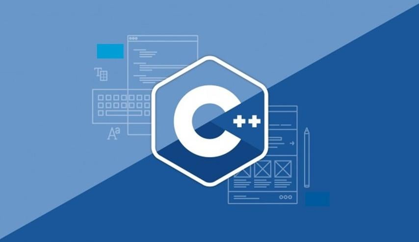

# Тема №2. Первые шаги 📒

**Компьютерная программа** — список команд (инструкций) для компьютера. Команды могут быть любыми, например:

- считать информацию с клавиатуры;
- произвести арифметические вычисления (+, −, *, /);
- вывести информацию на экран.

<div align="center">
  
</div>

Языки программирования бывают **компилируемые и интерпретируемые**. Если программа написана на компилируемом языке (C, C++, Pascal), то перед выполнением её нужно полностью проверить на наличие синтаксических ошибок и уже после этого перевести в понятную для компьютера форму — **машинный код**. Это делает специальная программа, которая называется **компилятором**.

Если программа написана на интерпретируемом языке (Python, PHP, Ruby), она не переводится в машинный код целиком. Вместо этого специальная программа, которая называется **интерпретатором**, идет по коду, анализирует его и выполняет каждую отдельную команду.

Существуют языки программирования, которые совмещают оба подхода (C#, Java). В таких языках код исходной программы сначала компилируется в промежуточный код **(байт-код)**, а уже потом, во время выполнения, переводится в машинный код.

**Процедурное программирование** подразумевает возможность создания в рамках программы локальных переменных, функций и процедур. Любая программа оперирует данными и содержит код для обработки этих данных.

## 🎀 Структура программы

С некоторой натяжкой можно утверждать, что таких частей четыре:
 
1. Блок заголовков программы. Обычно в этом блоке с помощью инструкции #include подключаются внешние файлы. 

2. Блок с объявлением классов (базовых и производных), прототипами и объявлениями функций. 

3. Главный метод программы: каждая программа имеет такой метод. У метода стандартное название `main()`. 

4. Блок с описанием функций (прототип которых указан во втором блоке). 

## ✨ Функция `main()`

Пожалуй, самая простая и короткая программа на **C++** — это программа, которая ничего не делает. Она выглядит так:

```cpp
int main() {
    return 0;
}
```

Здесь определяется функция с именем `main`, которая не принимает никаких аргументов (внутри круглых скобок ничего нет) и не выполняет никаких содержательных команд. В каждой программе на **C++** должна быть ровно одна функция `main` — с неё начинается выполнение программы.

У функции указан тип возвращаемого значения `int` (целое число), и она возвращает `0` — в данном случае это сообщение для операционной системы, что программа выполнилась успешно. И наоборот, ненулевой код возврата означает, что при выполнении возникла ошибка (например, программа получила некорректные входные данные).

Для функции `main` разрешается не писать завершающий `return 0`, чем мы и будем пользоваться далее для краткости. Поэтому самую короткую программу можно было бы написать вот так:

```cpp
int main() {
}
```

## 👋Hello, RTU MIREA!

Соблюдая традиции, напишем простейшую программу на **C++** — она выведет приветствие в консоль:

```cpp
#include <iostream>

int main() {
    std::cout << "Hello, RTU MIREA!\n";
}
```

Разберём её подробнее.

Директива `#include <iostream>` подключает стандартный библиотечный заголовочный файл для работы с потоками ввода-вывода (input-output streams). Для печати мы используем поток вывода `std::cout`, где `cout` расшифровывается как character output, то есть «символьный вывод».

В теле функции `main` мы передаём в `std::cout` строку `Hello, RTU MIREA!` с завершающим переводом строки `\n`. В зависимости от операционной системы `\n` будет преобразован в один или в два управляющих байта с кодами `0A` или `0D` `0A` соответственно.

Инструкции внутри тела функции завершаются точками с запятой.

## ☁️ Комментарии

**Комментарии** — это фрагменты программы, которые игнорируются компилятором и предназначены для программиста. В **C++** есть два вида комментариев — однострочные и многострочные:

```cpp
int main() {  // однострочный комментарий продолжается до конца строки

/* Пример
   многострочного
   комментария */
}
```

Мы будем использовать комментарии в примерах кода для пояснений, а в реальных программах ими лучше не злоупотреблять.

- Хорошо: комментировать, что делает библиотека, функция или класс или почему этот код написан именно так.

- Плохо: комментировать, что происходит на отдельных строчках. Это признак того, что код можно написать лучше.

## 📚 Библиотеки и заголовочные файлы

**Библиотека** — это код, который можно переиспользовать в разных программах. В стандарт языка **C++** входит спецификация так называемой стандартной библиотеки, которая поставляется вместе с компилятором. Она содержит различные структуры данных (контейнеры), типовые алгоритмы, средства ввода-вывода и т.д. Конструкции из этой библиотеки предваряются префиксом `std::`, который обозначает пространство имён.

Чтобы воспользоваться теми или иными библиотечными конструкциями, в начале программы надо подключить нужные заголовочные файлы. Так, в программе, которая печатала `Hello, RTU MIREA!`, нам уже встречался заголовочный файл `iostream` и конструкция `std::cout` из стандартной библиотеки.

## ❌ Ошибки компиляции

Перед запуском программу необходимо **скомпилировать**. Компилятор проверяет корректность программы и генерирует исполняемый файл. Во время компиляции компилятор может обнаружить синтаксические ошибки.

Рассмотрим пример такой программы

```cpp
#include <iostream>

int main() {
    cout << "Hello, world\n"
```

Компилятор может выдать такие сообщения:

```bash
$ clang++ hello.cpp
hello.cpp:4:5: error: use of undeclared identifier 'cout'; did you mean 'std::cout'?
    cout << "Hello, world!\n"
    ^~~~
    std::cout

hello.cpp:4:30: error: expected ';' after expression
    cout << "Hello, world!\n"
                             ^
                             ;

hello.cpp:5:1: error: expected '}'
^
a.cpp:3:12: note: to match this '{'
int main() {
           ^
3 errors generated.
```

**Первая ошибка** — вместо `std::cout` мы написали `cout`. **Вторая ошибка** — не поставили точку запятой после `"Hello, world!\n"`. Наконец, **третья** – не закрыли фигурную скобку с телом функции.

Ошибки компиляции (compile errors) следует отличать от возможных **ошибок времени выполнения** (runtime errors), которые происходят после запуска программы и, как правило, зависят от входных данных, неизвестных во время компиляции.

## 🌜 Переменные

Любая содержательная программа так или иначе обрабатывает данные в памяти. **Переменная** — это именованный блок данных определённого типа. Чтобы определить переменную, нужно указать её тип и имя. В общем виде это выглядит так:

```cpp
Type name;
```

где `Type` — конкретный тип данных (например, строка или число), а `name` — имя переменной. Имена переменных должны состоять из латинских букв, цифр и знаков подчёркивания и не должны начинаться с цифры. Также можно в одной строке определить несколько переменных одного типа:

```cpp
Type name1, name2, name3;
```

Например:

```cpp
#include <string>  // библиотека, в которой определён тип std::string

int main() {
    // Определяем переменную value целочисленного типа int
    int value;

    // Определяем переменные name и surname типа std::string (текстовая строка)
    std::string name, surname;
}
```

В этом примере мы используем встроенный в язык тип `int` (от слова integer — целое число) и поставляемый со стандартной библиотекой тип `std::string`. (Можно было бы использовать для строк встроенный тип с массивом символов, но это неудобно.)

Тип переменной должен быть известен компилятору во время компиляции.

От типа зависит:

- сколько байтов памяти потребуется для хранения данных;
- как интерпретировать эти байты;
- какие операции с этой переменной возможны.

Например, переменной типа `int` можно присваивать значения и с ней можно производить арифметические операции. Подробнее про разные типы данных и их размер в памяти мы поговорим ниже.

Важно понимать, что тип остаётся с переменной навсегда. Например, присвоить целочисленной переменной строку не получится — это вызовет ошибку компиляции:

```cpp
int main() {
    int value;
    value = 42;  // OK
    value = "Hello!";  // ошибка компиляции!
}
```

Переменные можно сразу проинициализировать значением. В **С++** есть много разных способов инициализации. Нам пока будет достаточно способа, который называется copy initialization:

```cpp
#include <string>

int main() {
    int value = 42;
    std::string title = "Bjarne Stroustrup";
}
```

Если переменная была объявлена, но нигде дальше не использовалась, то компилятор выдаёт об этом предупреждение. 

## 🍉 Потоковый ввод и вывод

**Поток** — это абстракция для чтения и записи последовательности данных в форматированном виде.

Записывать данные можно на экран консоли, в файл, буфер в памяти или в строку. Считывать их можно с клавиатуры, из файла, из памяти. Причём с каждым таким «устройством» можно связать свой поток.

Важно, что потоки не просто пересылают байты памяти, а применяют форматированный человекочитаемый ввод-вывод. Например, числа печатаются и считываются в десятичной нотации, хотя в памяти компьютера они хранятся в двоичном виде.

В программе `Hello, RTU MIREA!` нам уже встречался поток вывода `std::cout`, по умолчанию связанный с экраном консоли. Познакомимся с потоком ввода `std::cin`, связанным с клавиатурой. Для его использования нужен тот же заголовочный файл `iostream`.

Рассмотрим программу, которая спрашивает имя пользователя и печатает персональное приветствие:

```cpp
#include <iostream>
#include <string>

int main() {
    std::string name;  // объявляем переменную name
    std::cout << "What is your name?\n";
    std::cin >> name;  // считываем её значение с клавиатуры
    std::cout << "Hello, " << name << "!\n";
}
```

Обратите внимание на направление угловых скобок в этом примере — они условно показывают направление потока данных. При печати данные выводятся на экран, и стрелки направлены от текста к `cout`. При вводе данные поступают с клавиатуры, и стрелки направлены от `cin` к переменной.

В нашем примере в переменную `name` считается одно слово, которое будет выведено в ответном сообщении. Пример работы программы:

```bash
What is your name?
Artur
Hello, Artur!
```

Однако если ввести строку из нескольких слов с пробелами, то в `name` запишется только первое слово:

```bash
What is your name?
Artur Rustam
Hello, Artur!
```

Дело в том, что `cin` читает поток данных до ближайшего пробельного разделителя (пробела, табуляции, перевода строки или просто конца файла). Чтобы считать в строковую переменную всю строчку целиком (не включая завершающий символ перевода строки), нужно использовать функцию `std::getline` из заголовочного файла `string`:

```cpp
#include <iostream>
#include <string>

int main() {
    std::string name;
    std::getline(std::cin, name);
    std::cout << "Hello, " << name << "!\n";
}
```

В этом примере мы печатаем в одном выражении друг за другом несколько строк (`"Hello, "`, `name` и `"!\n"`), разделённых угловыми скобками `<<`. Таким образом, `cin` и `cout` позволяют кратко считывать и печатать несколько объектов одной командой.

Например, считывание нескольких чисел целого типа, набранных через пробельные разделители, может выглядеть так:

```cpp
int main() {
    int a;
    int b;
    int c;
    std::cin >> a >> b >> c;
}
```

Напечатать их значения можно следующим образом:

```cpp
std::cout << a << " " << b << " " << c << "\n";
```

Обратите внимание, что мы дополнительно вставляем между ними пробелы, чтобы в выводе числа не слиплись вместе. В конце вывода мы вставляем символ перевода строки `\n`, чтобы отделить этот результат от последующего вывода или от сообщений командной строки.

## 🌳 Таблица встроенных типов данных в C++

| Тип данных       | Размер (байт) | Диапазон значений                                    |
|------------------|---------------|------------------------------------------------------|
| `bool`           | 1             | `true` или `false`                                  |
| `char`           | 1             | от `-128` до `127` (или `0` до `255`, если unsigned)|
| `wchar_t`        | 2 / 4         | зависит от реализации                               |
| `char16_t`       | 2             | `0` до `65,535`                                     |
| `char32_t`       | 4             | `0` до `4,294,967,295`                              |
| `short`          | 2             | `-32,768` до `32,767`                               |
| `unsigned short` | 2             | `0` до `65,535`                                     |
| `int`            | 4             | `-2,147,483,648` до `2,147,483,647`                 |
| `unsigned int`   | 4             | `0` до `4,294,967,295`                              |
| `long`           | 8 (на x64)    | `-9,223,372,036,854,775,808` до `9,223,372,036,854,775,807` |
| `unsigned long`  | 8             | `0` до `18,446,744,073,709,551,615`                 |
| `long long`      | 8             | `-9,223,372,036,854,775,808` до `9,223,372,036,854,775,807` |
| `unsigned long long` | 8         | `0` до `18,446,744,073,709,551,615`                 |
| `float`          | 4             | ~ `±3.4e−38` до `±3.4e+38` (точность ~7 знаков)     |
| `double`         | 8             | ~ `±1.7e−308` до `±1.7e+308` (точность ~15 знаков)  |
| `long double`    | 16 (обычно)   | ~ `±3.4e−4932` до `±1.1e+4932` (точность ~18–19 знаков) |

---

### ⚠️ Примечания:

- Размеры могут зависеть от архитектуры и компилятора.  
- На 32-битных системах `long` обычно равен 4 байта.  
- Для точного определения диапазона используйте заголовок `<limits>` и класс `std::numeric_limits<T>`.  

---

## 🫐 Арифметические операторы в C++

| Оператор | Описание                                | Пример         | Результат   |
|----------|------------------------------------------|----------------|-------------|
| `+`      | Сложение                                | `5 + 3`        | `8`         |
| `-`      | Вычитание                               | `5 - 3`        | `2`         |
| `*`      | Умножение                               | `5 * 3`        | `15`        |
| `/`      | Деление (целое или вещественное)        | `7 / 2`        | `3` (int) / `3.5` (double) |
| `%`      | Остаток от деления (только для целых)   | `7 % 2`        | `1`         |
| `++`     | Инкремент (увеличение на 1)             | `a++` или `++a`| если `a=5` → `6` |
| `--`     | Декремент (уменьшение на 1)             | `a--` или `--a`| если `a=5` → `4` |

---

### ℹ️ Примечания

- `a++` (постфиксная форма) возвращает старое значение, затем увеличивает `a`.  
- `++a` (префиксная форма) сначала увеличивает `a`, затем возвращает новое значение.  
- Деление `/` между целыми числами отбрасывает дробную часть.  
- Остаток `%` работает только для целых типов.  

## 🍍 Операторы сравнения в C++

| Оператор | Описание                         | Пример     | Результат |
|----------|----------------------------------|------------|-----------|
| `==`     | Равно                            | `5 == 5`   | `true`    |
| `!=`     | Не равно                         | `5 != 3`   | `true`    |
| `>`      | Больше                           | `7 > 3`    | `true`    |
| `<`      | Меньше                           | `2 < 5`    | `true`    |
| `>=`     | Больше или равно                 | `5 >= 5`   | `true`    |
| `<=`     | Меньше или равно                 | `3 <= 7`   | `true`    |

---

### ⚠️ Примечания:

- Операторы сравнения возвращают значение типа **bool** (`true` или `false`).  
- Их можно использовать в условных выражениях (`if`, `while`, `for`).  
- В выражениях можно сравнивать как числа, так и строки (например, `std::string`).  

## 📌 Задачи для практики

### 🔹 Задача 1. Сумма двух чисел
Даны два числа `A` и `B` (не превосходящие по модулю `2 147 483 647`), которые вводятся через пробел.  
Напишите программу, которая выводит их **сумму**.

---

### 🔹 Задача 2. Арифметические операции
Даны два числа `A` и `B` (не превосходящие по модулю `2 147 483 647`), которые вводятся через пробел.  
Напишите программу, которая выводит через пробел:
- их сумму `A + B`,  
- разность `A - B`,  
- произведение `A * B`,  
- частное `A / B`.  

---

### 🔹 Задача 3. Гипотенуза
Даны два числа `a` и `b`.  
Найдите гипотенузу прямоугольного треугольника с катетами `a` и `b`.

---

### 🔹 Задача 4. МКАД
Длина Московской кольцевой автомобильной дороги (МКАД) — **109 километров**.  
Байкер Вася стартует с нулевого километра МКАД и едет со скоростью `v` километров в час.  
На какой отметке он остановится через `t` часов?

---

### 🔹 Задача 5. Электронные часы
Электронные часы показывают время в формате `h:mm:ss`, где:
- `h` — часы,
- `mm` — минуты (обязательно двузначные),
- `ss` — секунды (обязательно двузначные).

С начала суток прошло `n` секунд.  
Выведите, что покажут часы.

---

<div align="center"> Made with ❤️ by <b>dv0retsky</b> </div>