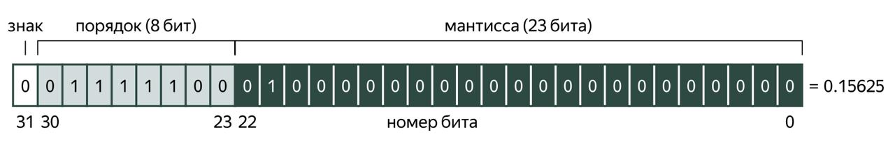

# Тема №3. Типы данных 🌊

**C++ — язык со статической типизацией.** У каждой переменной на этапе компиляции должен быть чётко определённый тип данных. Про каждый тип данных заранее известно, сколько места в памяти занимает переменная такого типа.

В этом теме мы познакомимся с некоторыми базовыми типами данных и с понятием области видимости переменных.

<div align="center">
  
</div>

## 🌍 Области видимости

В **С++** существует понятие области видимости переменной. Эта область ограничивается блоком кода, в котором переменная определена. Рассмотрим пример:

```cpp
#include <iostream>

int a = 1;  // глобальная переменная

int main() {
    int b = 2;  // локальная переменная
    {
        int c = 3;  // локальная переменная внутри блока
        std::cout << a << " " << b << " " << c << "\n";  // корректно
    }

    // Эта строчка не скомпилируется,
    // так как переменная c не определена в данной области:
    std::cout << c << "\n";
}
```

В этом примере есть три области:

- глобальная, в которой определена переменная `a`;
- тело функции `main`, в которой определена переменная `b`;
- внутренний блок, в котором определена переменная `c`.

В последней строке примера переменная `c` недоступна, так как её область видимости уже закончилась. В случае коллизии имён компилятор всегда выбирает самую вложенную область видимости. 

Рассмотрим пример:

```cpp
#include <iostream>

int main() {
    int x = 1;
    std::cout << x << "\n";  // напечатает 1
    {
        int x = 2;  // новая переменная, к предыдущему x не имеет отношения
        std::cout << x << "\n";  // напечатает 2
    }
    std::cout << x << "\n";  // снова напечатает 1
}
```

## 🦆 Инициализация локальных переменных

Локальные переменные простых типов, таких как `int`, не инициализируются по умолчанию нулём. Компилятор просто выделяет для них байты в стековой памяти, но при этом он не обязан как-либо их заполнять. Это один из принципов **C++:** ***мы не должны платить за то, что не используем.***

Следующий фрагмент кода может напечатать всё что угодно:

```cpp
#include <iostream>

int main() {
    int x;
    std::cout << x << "\n";  // неопределённое поведение!
    int y;
    std::cin >> y;  // а это допустимый сценарий
}
```

Компиляторы `g++` и `clang++` обычно дают предупреждения о чтении неинициализированных переменных при использовании опции `-Wall` или `-Wuninitialized`:

```bash
$ clang++ -Wall program.cpp
program.cpp:5:18: warning: variable 'x' is uninitialized when used here [-Wuninitialized]
    std::cout << x << "\n";  // неопределённое поведение!
                 ^
program.cpp:4:10: note: initialize the variable 'x' to silence this warning
    int x;
         ^
          = 0
1 warning generated.
```

Заметим, что `std::string` является сложным типом и переменные такого типа всегда по умолчанию инициализируются пустой строкой. Поэтому нет необходимости писать `std::string s = "";`. Пишите просто `std::string s;`.

## 🐻‍❄️ Простые типы данных

С типом `int` мы уже знакомы. Рассмотрим другие фундаментальные типы данных в **С++**. Это так называемые интегральные типы и типы для вещественных чисел.

| Тип данных      | Пример использования              | Размер (обычно) | Описание                                                                 |
|-----------------|-----------------------------------|-----------------|--------------------------------------------------------------------------|
| `char`          | `char c = '1';`                  | 1 байт          | Символьный тип (хранит один символ в кодировке ASCII).                   |
| `bool`          | `bool b = true;`                 | 1 байт          | Логический тип (значения `true` или `false`).                            |
| `short int`     | `short int si = 17;`             | 2 байта         | Короткое целое число.                                                    |
| `int`           | `int i = 42;`                    | 4 байта         | Целое число (размер зависит от архитектуры, чаще всего 4 байта).         |
| `long`          | `long li = 12321321312;`         | 8 байт          | Длинное целое число (на 64-битных системах обычно 8 байт).               |
| `long long`     | `long long lli = 12321321312;`   | 8 байт          | Очень длинное целое число (не меньше, чем `long`).                       |
| `float`         | `float f = 2.71828;`             | 4 байта         | Число с плавающей запятой одинарной точности.                            |
| `double`        | `double d = 3.141592;`           | 8 байт          | Число с плавающей запятой двойной точности.                              |
| `long double`   | `long double ld = 1e15;`         | 16 байт         | Число с плавающей запятой повышенной точности (зависит от компилятора).  |


Обратите внимание, что символы, в отличие от строк (то есть массивов символов), записываются в апострофах, а не в кавычках. В примере выше мы записываем в переменную `с` символ единицы. Фактически в памяти хранится **ASCII-код** этого символа, который равен `49`.

Напомним, что каждый тип данных занимает заранее известное количество байтов памяти. Стандарт языка **С++** не накладывает жёстких ограничений на размеры типов, они могут отличаться для разных платформ и компиляторов.


О том, что делать с этой особенностью, рассмотрим ниже. А пока отметим, что узнать размер переменной или типа на этапе компиляции можно с помощью оператора `sizeof`.

Например, на 64-битной Linux-системе компилятор `clang++` использует такие размеры для типов:

```cpp
int main() {
    std::cout << "char: " << sizeof(char) << "\n";                 //  1
    std::cout << "bool: " << sizeof(bool) << "\n";                 //  1
    std::cout << "short int: " << sizeof(short int) << "\n";       //  2 (по стандарту >= 2)
    std::cout << "int: " << sizeof(int) << "\n";                   //  4 (по стандарту >= 2)
    std::cout << "long int: " << sizeof(long int) << "\n";         //  8 (по стандарту >= 4)
    std::cout << "long long int: " << sizeof(long long) << "\n";   //  8 (по стандарту >= 8)
    std::cout << "float: " << sizeof(float) << "\n";               //  4
    std::cout << "double: " << sizeof(double) << "\n";             //  8
    std::cout << "long double: " << sizeof(long double) << "\n";   // 16
}
```

## 🐬 Размеры стандартных типов

По умолчанию числовые типы – **знаковые**. Они имеют диапазон значений от: `-2^(n-1)` до `2^(n-1) - 1`, где *n* – количество битов, занимаемых типом. Приставка `unsigned` перед типом делает его **беззнаковым**. В этом случае диапазон допустимых значений будет от: `0` до `2^n - 1`.

```cpp
int main() {
    unsigned int ui = 4294967295;  // 2^32 - 1
}
```

Минимальное и максимальное значение, помещающееся в данный числовой тип, можно получить так:

```cpp
#include <iostream>
#include <limits>  // необходимо для numeric_limits

int main() {
    // посчитаем для типа int:
    std::cout << "minimum value: " << std::numeric_limits<int>::min() << "\n"
              << "maximum value: " << std::numeric_limits<int>::max() << "\n";
}
```

Данный пример на **64-битной Linux-системе** напечатает:

```bash
minimum value: -2147483648
maximum value: 2147483647
```

Приведённые выше примеры вывода оператора `sizeof` верны для **64-битных архитектур**, которые на сегодняшний день распространены повсеместно. Однако если бы мы скомпилировали и запустили такую программу на компьютере с **32-битной архитектурой**, то получили бы другие результаты. Например, `sizeof(long int)` стал бы равен 4, в то время как на современных компьютерах мы получили бы 8. Также бывают встраиваемые системы, под которые тоже можно писать на С++. Там битность архитектуры может быть ещё меньше, чем 32.

В заголовочном файле cstdint стандартной библиотеки имеются целочисленные типы с фиксированным размером:

- `int8_t` / `uint8_t`
- `int16_t` / `uint16_t`
- `int32_t` / `uint32_t`
- `int64_t` / `uint64_t`

Число в имени типа означает количество бит, используемых для хранения в памяти. Например, `int32_t` содержит 32 бита (4 байта) и часто соответствует типу `int`. Если система не поддерживает какой-то тип, то программа с ним просто не скомпилируется.

## 🍡 Переполнение целочисленных типов

Стандартные числовые типы имеют ограниченный размер и ограниченное множество допустимых значений. При арифметических операциях над числами таких типов может возникнуть переполнение — ситуация, когда результат операции не помещается в тип:

```cpp
#include <iostream>

int main() {
    unsigned int a = 123456;  // на 64-битной платформе sizeof(a) == 4

    // Произведение a * a не помещается в 4 байта, так как оно больше 2^32
    std::cout << a * a << "\n";
}
```

В этом примере выражение `a * a` будет иметь тот же тип, что и аргументы. То, что на самом деле будет вычислено, зависит от знаковости типа.

Беззнаковые типы можно спокойно переполнять: вычисления будут производиться по модулю соответствующей степени двойки. Другими словами, будут учтены только младшие биты результата:

```cpp
int main() {
    unsigned int x = 0;      // на 64-битной платформе sizeof(x) == 4
    unsigned int y = x - 1;  // 4294967295, то есть 2**32 - 1
    unsigned int z = y + 1;  // 0
}
```

Наоборот, для знаковых типов переполнение приводит к так называемому **неопределённому поведению** (UB, undefined behavior).

Такая ситуация не считается ошибкой компиляции (в самом деле, на стадии компиляции значения переменных могут быть ещё неизвестны). Но в этом случае стандарт **С++** перестаёт что-либо гарантировать по поводу поведения программы. Компиляторы могут использовать такие случаи для оптимизации программ, полагаясь на то, что разработчики пишут код корректно и никогда не допускают неопределённого поведения. Далее нам встретятся и другие случаи неопределённого поведения.

**Беззнаковые типы** следует использовать, когда вы имеете дело с битовыми наборами. В остальных случаях предпочтительнее использовать **знаковые типы**.

## 🍫 Арифметические операции

Бинарные операции `+`, `-` и `*` работают для чисел стандартным образом. Результат операции деления `/`, применённой к целым числам, всегда округляется в сторону нуля. Таким образом, для положительных чисел операция `/` возвращает неполное частное. Остаток от деления целых чисел можно получить с помощью операции `%`.

```cpp
int main() {
    int a = 7, b = 3;
    int q = a / b;  // 2
    int r = a % b;  // 1
}
```

Если при делении нужно получить обычное частное, то один из аргументов нужно привести к вещественному типу (например, `double`) с помощью оператора `static_cast`:

```cpp
int main() {
    int a = 6, b = 4;
    double q = static_cast<double>(a) / b;  // 1.5
}
```

Можно было бы написать чуть более кратко: `double q = a * 1.0 / b;`. Тогда преобразование аргументов произошло бы неявно.

Арифметические операции над символами, а также сравнение символов друг с другом — это фактически операции над их ASCII-кодами:

```cpp
#include <iostream>

int main() {
    char c = 'A';
    c += 25;  // увеличиваем ASCII-код символа на 25
    std::cout << c << "\n";  // Z
}
```

### 🧩 Таблица ASCII с шестнадцатеричными кодами символов. 

| Dec | Hex  | Char  | Описание (RU)                             |
|-----:|:-----|:------|:-------------------------------------------|
| 0   | 0x00 | NUL   | Null (заполнитель, конец строки в некоторых протоколах) |
| 1   | 0x01 | SOH   | Start of Heading                            |
| 2   | 0x02 | STX   | Start of Text                               |
| 3   | 0x03 | ETX   | End of Text                                 |
| 4   | 0x04 | EOT   | End of Transmission                         |
| 5   | 0x05 | ENQ   | Enquiry                                     |
| 6   | 0x06 | ACK   | Acknowledge                                 |
| 7   | 0x07 | BEL   | Bell (звук/сигнал)                          |
| 8   | 0x08 | BS    | Backspace                                   |
| 9   | 0x09 | TAB   | Horizontal Tab (табуляция)                  |
| 10  | 0x0A | LF    | Line Feed (перевод строки, `\n`)            |
| 11  | 0x0B | VT    | Vertical Tab                                 |
| 12  | 0x0C | FF    | Form Feed (переход на новую страницу)       |
| 13  | 0x0D | CR    | Carriage Return (возврат каретки, `\r`)     |
| 14  | 0x0E | SO    | Shift Out                                    |
| 15  | 0x0F | SI    | Shift In                                     |
| 16  | 0x10 | DLE   | Data Link Escape                              |
| 17  | 0x11 | DC1   | Device Control 1                              |
| 18  | 0x12 | DC2   | Device Control 2                              |
| 19  | 0x13 | DC3   | Device Control 3                              |
| 20  | 0x14 | DC4   | Device Control 4                              |
| 21  | 0x15 | NAK   | Negative Acknowledge                           |
| 22  | 0x16 | SYN   | Synchronous Idle                                |
| 23  | 0x17 | ETB   | End of Transmission Block                       |
| 24  | 0x18 | CAN   | Cancel                                          |
| 25  | 0x19 | EM    | End of Medium                                   |
| 26  | 0x1A | SUB   | Substitute                                      |
| 27  | 0x1B | ESC   | Escape                                          |
| 28  | 0x1C | FS    | File Separator                                  |
| 29  | 0x1D | GS    | Group Separator                                 |
| 30  | 0x1E | RS    | Record Separator                                |
| 31  | 0x1F | US    | Unit Separator                                  |
| 32  | 0x20 | `SPACE` | Пробел                                        |
| 33  | 0x21 | `!`   | Восклицательный знак                           |
| 34  | 0x22 | `"`   | Двойная кавычка                                |
| 35  | 0x23 | `#`   | Решётка (hash)                                 |
| 36  | 0x24 | `$`   | Знак доллара                                    |
| 37  | 0x25 | `%`   | Процент                                         |
| 38  | 0x26 | `&`   | Амперсанд                                       |
| 39  | 0x27 | `'`   | Одинарная кавычка                               |
| 40  | 0x28 | `(`   | Левая круглая скобка                            |
| 41  | 0x29 | `)`   | Правая круглая скобка                           |
| 42  | 0x2A | `*`   | Звёздочка (asterisk)                            |
| 43  | 0x2B | `+`   | Плюс                                           |
| 44  | 0x2C | `,`   | Запятая                                         |
| 45  | 0x2D | `-`   | Минус / дефис                                   |
| 46  | 0x2E | `.`   | Точка                                           |
| 47  | 0x2F | `/`   | Косая черта (slash)                             |
| 48  | 0x30 | `0`   | Цифра 0                                        |
| 49  | 0x31 | `1`   | Цифра 1                                        |
| 50  | 0x32 | `2`   | Цифра 2                                        |
| 51  | 0x33 | `3`   | Цифра 3                                        |
| 52  | 0x34 | `4`   | Цифра 4                                        |
| 53  | 0x35 | `5`   | Цифра 5                                        |
| 54  | 0x36 | `6`   | Цифра 6                                        |
| 55  | 0x37 | `7`   | Цифра 7                                        |
| 56  | 0x38 | `8`   | Цифра 8                                        |
| 57  | 0x39 | `9`   | Цифра 9                                        |
| 58  | 0x3A | `:`   | Двоеточие                                      |
| 59  | 0x3B | `;`   | Точка с запятой                                 |
| 60  | 0x3C | `<`   | Меньше (знак `<`)                               |
| 61  | 0x3D | `=`   | Равно                                           |
| 62  | 0x3E | `>`   | Больше (знак `>`)                               |
| 63  | 0x3F | `?`   | Вопросительный знак                             |
| 64  | 0x40 | `@`   | Собачка (at sign)                               |
| 65  | 0x41 | `A`   | Заглавная латинская A                           |
| 66  | 0x42 | `B`   | Заглавная B                                     |
| 67  | 0x43 | `C`   | Заглавная C                                     |
| 68  | 0x44 | `D`   | Заглавная D                                     |
| 69  | 0x45 | `E`   | Заглавная E                                     |
| 70  | 0x46 | `F`   | Заглавная F                                     |
| 71  | 0x47 | `G`   | Заглавная G                                     |
| 72  | 0x48 | `H`   | Заглавная H                                     |
| 73  | 0x49 | `I`   | Заглавная I                                     |
| 74  | 0x4A | `J`   | Заглавная J                                     |
| 75  | 0x4B | `K`   | Заглавная K                                     |
| 76  | 0x4C | `L`   | Заглавная L                                     |
| 77  | 0x4D | `M`   | Заглавная M                                     |
| 78  | 0x4E | `N`   | Заглавная N                                     |
| 79  | 0x4F | `O`   | Заглавная O                                     |
| 80  | 0x50 | `P`   | Заглавная P                                     |
| 81  | 0x51 | `Q`   | Заглавная Q                                     |
| 82  | 0x52 | `R`   | Заглавная R                                     |
| 83  | 0x53 | `S`   | Заглавная S                                     |
| 84  | 0x54 | `T`   | Заглавная T                                     |
| 85  | 0x55 | `U`   | Заглавная U                                     |
| 86  | 0x56 | `V`   | Заглавная V                                     |
| 87  | 0x57 | `W`   | Заглавная W                                     |
| 88  | 0x58 | `X`   | Заглавная X                                     |
| 89  | 0x59 | `Y`   | Заглавная Y                                     |
| 90  | 0x5A | `Z`   | Заглавная Z                                     |
| 91  | 0x5B | `[`   | Левая квадратная скобка                         |
| 92  | 0x5C | `\`   | Обратная косая (backslash)                      |
| 93  | 0x5D | `]`   | Правая квадратная скобка                        |
| 94  | 0x5E | `^`   | Крышка (caret)                                  |
| 95  | 0x5F | `_`   | Подчёркивание (underscore)                      |
| 96  | 0x60 | `` ` `` | Обратная кавычка (backtick)                  |
| 97  | 0x61 | `a`   | Строчная латинская a                             |
| 98  | 0x62 | `b`   | Строчная b                                       |
| 99  | 0x63 | `c`   | Строчная c                                       |
|100  | 0x64 | `d`   | Строчная d                                       |
|101  | 0x65 | `e`   | Строчная e                                       |
|102  | 0x66 | `f`   | Строчная f                                       |
|103  | 0x67 | `g`   | Строчная g                                       |
|104  | 0x68 | `h`   | Строчная h                                       |
|105  | 0x69 | `i`   | Строчная i                                       |
|106  | 0x6A | `j`   | Строчная j                                       |
|107  | 0x6B | `k`   | Строчная k                                       |
|108  | 0x6C | `l`   | Строчная l                                       |
|109  | 0x6D | `m`   | Строчная m                                       |
|110  | 0x6E | `n`   | Строчная n                                       |
|111  | 0x6F | `o`   | Строчная o                                       |
|112  | 0x70 | `p`   | Строчная p                                       |
|113  | 0x71 | `q`   | Строчная q                                       |
|114  | 0x72 | `r`   | Строчная r                                       |
|115  | 0x73 | `s`   | Строчная s                                       |
|116  | 0x74 | `t`   | Строчная t                                       |
|117  | 0x75 | `u`   | Строчная u                                       |
|118  | 0x76 | `v`   | Строчная v                                       |
|119  | 0x77 | `w`   | Строчная w                                       |
|120  | 0x78 | `x`   | Строчная x                                       |
|121  | 0x79 | `y`   | Строчная y                                       |
|122  | 0x7A | `z`   | Строчная z                                       |
|123  | 0x7B | `{`   | Левая фигурная скобка                             |
|124  | 0x7C | `|`   | Вертикальная черта (pipe)                         |
|125  | 0x7D | `}`   | Правая фигурная скобка                            |
|126  | 0x7E | `~`   | Тильда                                           |
|127  | 0x7F | DEL   | Delete (удаление / контрольный символ)           |

---

Операция `+` применительно к строкам означает **конкатенирование** (то есть склейку). Это пример перегрузки операции: изначальному оператору сложения чисел в стандартной библиотеке для строки придали новый смысл.

```cpp
#include <string>

int main() {
    std::string a = "Hello, ";
    std::string b = "world!";
    std::string c = a + b;  // Hello, world!
}
```

Для каждой бинарной операции (например, `+`) есть версия со знаком равенства (`+=`) для случая, когда левый аргумент совпадает с переменной, которой присваивается результат:

```cpp
int main() {
    int x = 5;
    x += 3;  // x = x + 3
    x *= x;  // x = x * x
}
```

Наконец, имеются операторы `++` и `--` для увеличения или уменьшения переменной на единицу. Они бывают префиксные (`++x`) и постфиксные (`x++`). Отличие состоит в значении выражения, которое будет вычисляться при применении такого оператора. Мы рассмотрим это позже, а пока привыкнем по умолчанию использовать префиксный оператор для обычных чисел:

```cpp
int main() {
    int x = 5;
    ++x;  // 6
    --x;  // снова 5
}
```

## 🧃 Числа с плавающей точкой

В языке **C++** существуют три встроенных типа для записи дробных чисел: `float` (4 байта), `double` (8 байт) и `long double` (16 или 8 байт, в зависимости от платформы). В большинстве случаев рекомендуется использовать тип `double`.Тип `float` разумно использовать там, где обрабатываются огромные массивы чисел, и возникает необходимость экономить память.

Как правило, хранение дробных чисел в **С++** основано на стандарте [IEEE 754](https://en.wikipedia.org/wiki/IEEE_754). Число представляется в виде двоичной дроби в экспоненциальной записи: отдельно хранятся бит знака, порядок и мантисса.

<div align="center">
  
</div>

Такое представление выгодно отличается от чисел с фиксированной точкой, где хранится фиксированное количество разрядов. Оно позволяет, хотя и с разной степенью точности, представлять числа, отличающиеся на порядки.

При работе с рациональными числами, знаменатель которых не является степенью двойки, неизбежно возникают погрешности представления. 

## 🎸 Автоматический вывод типа

Компилятор **C++** умеет автоматически выводить тип переменной по значению, которое ей присваивается. Для этого вместо типа надо написать ключевое слово `auto`:

```cpp
int main() {
    auto x = 42;  // int
    auto pi = 3.14159;  // double
}
```

Ключевое слово `auto` позволяет сократить код и не выписывать сложные типы. При использовании `auto` со строками нужно быть осторожным. Важно знать, что конструкция `auto s = "hello"` выведет низкоуровневый тип `const char *` (указатель на неизменяемый набор символов в памяти), а не тип-обёртку `std::string`.

## 📌 Задачи для практики

 ### 🔹 Задача 1. Иван Иванович и ФНС

45-летний скамер Иван Иванович занимался отмыванием денег:  
в первый день он отмыл `X` тыс. рублей, а в каждый последующий день данная сумма увеличивалась на 10%.  

Федеральная налоговая служба (ФНС) планирует заинтересоваться Иваном Ивановичем в тот день, когда сумма отмытого превысит `Y` тыс. рублей.  

Напишите программу, которая определяет, на какой день небо Ивана Ивановича станет «в клеточку» (ФНС им займётся).

---

<div align="center"> Made with ❤️ by <b>dv0retsky</b> </div>