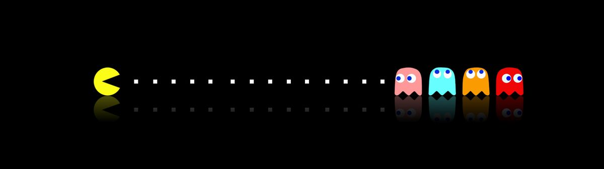

# Тема №4. Ветвления и циклы 🐥

В рамках данной темы мы познакомимся с операторами ветвления `if` и `switch`, циклами `while`, `do-while` и `for`, а также с оператором `goto`.

<div align="center">
  
</div>

## 🌵 Оператор `if`

Условный оператор `if` записывается так:

```cpp
if (condition) {
    // код, который исполнится в случае, когда условие condition истинно
}
```

Дополнительно можно добавить ветку кода для случая, когда условие ложно:

```cpp
if (condition) {
    // код, который исполнится, если condition истинно
} else {
    // код, который исполнится, если condition ложно
}
```

Также можно выстроить цепочку условных операторов:

```cpp
if (condition1) {
    // случай, когда condition1 истинно
} else if (condition2) {
    // случай, когда condition1 ложно, а condition2 истинно
} else if (condition3) {
    // случай, когда condition1 и condition2 ложны, а condition3 истинно
} else {
    // случай, когда condition1, condition2 и condition3 ложны
}
```

Если код внутри фигурных скобок состоит из одной инструкции, то фигурные скобки можно не писать. Однако рекомендуется ставить фигурные скобки всегда во избежание ошибок.

На месте `condition` может стоять любое выражение логического типа. Простейшие примеры таких выражений — это проверка на равенство (`==`) и неравенство (`!=`), а также сравнения на меньше / больше (`<`, `<=`, `>` и `>=`):

```cpp
#include <iostream>

int main() {
    int x;
    std::cin >> x;
    if (x <= 0) {
        std::cout << "zero or negative\n";
    } else if (x == 1) {
        std::cout << "one\n";
    } else if (x == 2) {
        std::cout << "two\n";
    } else {
        std::cout << "many\n";
    }
}
```

## 🍄 Сложные условия

Условия можно комбинировать с помощью логических операторов `&&` (и), `||` (или) и `!` (не). Рассмотрим пример, где проверяется принадлежность точки разным интервалам на прямой.

```cpp
int main() {
    int a, b, x;
    /* Тут должна быть логика заполнения объявленных переменных,
    но мы её опустили, чтобы не отвлекаться */

    if (a <= x && x <= b) {
        // точка x лежит на отрезке [a; b]
    } else {
        // точка x лежит вне отрезка [a; b]
    }

    // то же самое можно было бы проверить так:
    if (!(x < a || x > b)) {  // отрицание
        // точка x лежит на отрезке [a; b]
    } else {
        // точка x лежит вне отрезка [a; b]
    }
}
```

Обратите внимание, что двойное неравенство некорректно проверять через `a <= x <= b`. Так можно написать, но смысл будет совсем другим: результат сравнения `a <= x` будет приведён к нулю или единице, и полученное число будет сравниваться с `b`.

Операторы сравнения имеют больший приоритет, чем логические операторы, поэтому скобки вокруг элементарных сравнений в сложных условиях не обязательны. А вот оператор отрицания имеет высокий приоритет, поэтому в последнем примере он применяется к условию в скобках. Таблицу приоритета операторов 
**C++** можно посмотреть [здесь](https://en.cppreference.com/w/cpp/language/operator_precedence.html).

Операторы `&&` и `||` ведут себя **лениво**: если первого аргумента уже достаточно для ответа, то второй аргумент вычисляться не будет. Например, в выражении ``condition1 && condition2`` второе условие не вычисляется, если первое ложно. Это часто используют для проверок корректности:

```cpp
    int a, b;
    // ...
    if (a != 0 && b % a == 0) {
        // b делится на a
    }
```

## 🫧 Сравнение чисел с плавающей точкой

Рассмотрим программу, которая проверяет равенство `0.1 + 0.2 == 0.3`:

```cpp
#include <iostream>

int main() {
    double x = 0.1, y = 0.2;
    if (x + y == 0.3) {
        std::cout << "EQUAL ";
    } else {
        std::cout << "NOT EQUAL ";
    }

    std::cout << x + y << "\n";
}
```

Логично было бы предположить, что программа выведет `EQUAL 0.3`, потому что 0.1 + 0.2 = 0.3. Однако программа напечатает `NOT EQUAL 0.3`. Данная **«ошибка вычисления»** встречается в большинстве современных языков программирования и обусловлена погрешностью представления этих чисел. Если повысить число знаков дробной части в выводе, мы увидим, что `0.1 + 0.2 == 0.30000000000000004`.

Поскольку операции над числами с плавающей точкой могут содержать погрешность, обычное сравнение через `==` некорректно. Поэтому правильнее сравнивать модуль разности величин с некой допустимой для нас погрешностью. Модуль дробного числа можно получить с помощью функции `std::abs` из заголовочного файла `cmath`. Исходную программу можно было бы переписать так:

```cpp
#include <cmath>
#include <iostream>

int main() {
    double delta = 0.000001;

    double x = 0.1, y = 0.2;
    double sum = x + y;

    if (std::abs(sum - 0.3) < delta) {
        std::cout << "EQUAL ";
    } else {
        std::cout << "NOT EQUAL ";
    }

    std::cout << sum << "\n";
}
```

Теперь программа выведет `EQUAL 0.3`.

## 🧽 Оператор `switch`

Рассмотрим простейший калькулятор, считывающий число, затем знак арифметической операции, а затем другое число и печатающий результат. Напишем сначала программу с помощью `if` и `else`.

```cpp
#include <cstdint>
#include <iostream>

int main() {
    int64_t a, b;
    char operation;
    std::cin >> a >> operation >> b;

    int64_t result = 0;
    if (operation == '+') {
        result = a + b;
    } else if (operation == '-') {
        result = a - b;
    } else if (operation == '*') {
        result = a * b;
    } else if (operation == '/' || operation == ':') {
        result = a / b;
    } else if (operation == '%') {  // остаток от деления
        result = a % b;
    }

    std::cout << result << "\n";
}
```

Перепишем эту программу через оператор `switch`. Этот оператор следует рассматривать как условный прыжок на соответствующую метку в зависимости от значения выражения.

```cpp
#include <cstdint>
#include <iostream>

int main() {
    int64_t a, b;
    char operation;
    std::cin >> a >> operation >> b;

    int64_t result;
    switch (operation) {
        case '+':
            result = a + b;
            break;  // если не написать этот break, программа просто пойдёт дальше в код следующего блока case
        case '-':
            result = a - b;
            break;
        case '*':
            result = a * b;
            break;
        case '/':
        case ':':
            result = a / b;
            break;
        case '%':
            result = a % b;
            break;
        default:  // здесь обрабатывается случай, когда ни один case не сработал.
            result = 0;
    }

    std::cout << result << "\n";
}
```

Выражения внутри скобок оператора `switch` и в блоках `case` должны быть простого целочисленного или символьного типа. В приведённой выше программе значение `+` относится к типу `char`. Использование сложных типов (например, строк) приведёт к ошибке компиляции:

```cpp
int main() {
    std::string name;
    std::cin >> name;
    switch (name) {  // ошибка компиляции
        case "Artur":
           std::cout << "Hello, Artur!\n";
           break;
    }
}
```

## 🌶️ Цикл `while`

В C++ существует несколько видов циклов. Цикл `while` — это цикл с предусловием. Перед очередной итерацией проверяется условие, и если оно истинно, то цикл продолжается. Рассмотрим пример печати таблицы квадратов чисел от `1` до `10`:

```cpp
#include <iostream>

int main() {
    int n = 1;
    while (n <= 10) {
        std::cout << n << "\t" << n * n << "\n";  // выводим число и его квадрат через табуляцию
        ++n;
    }
}
```

Здесь мы намеренно разделяем числа и их квадраты не пробелом, а знаком табуляции `\t`. В консоли такой вывод будет выглядеть выровненным по колонкам с фиксированной шириной:

```bash
1	1
2	4
3	9
4	16
5	25
6	36
7	49
8	64
9	81
10	100
```

## 🍤 Цикл `do-while`

Это цикл с постусловием. Отличие от цикла `while` заключается в том, что первая итерация всегда выполняется безусловно. Только после её завершения проверяется условие цикла. Если оно истинно, то цикл продолжается.

```cpp
#include <iostream>

int main() {
    int n = 1;
    do {
        std::cout << n << "\t" << n * n << "\n";
        ++n;
    } while (n <= 10);
}
```

Без особых причин пользоваться этим видом циклов не стоит, старайтесь использовать циклы `while` или `for`.

## 🥑 Цикл `for`

Цикл `for` — самый гибкий. Он записывается так:

```cpp
for (initialization; condition; action) {
    // тело цикла
}
```

Как правило, с циклом ассоциируется некоторый параметр, который меняется от итерации к итерации, а цикл выполняется до тех пор, пока некоторое условие на этот параметр истинно.

Начальное значение такого параметра можно задать в разделе `initialization`, условие — в `condition`, а действие над параметром, выполняющееся после каждой итерации, — в `action`.

Напечатаем таблицу квадратов через цикл `for`:

```cpp
#include <iostream>

int main() {
    for (int i = 1; i <= 10; ++i) {
        std::cout << i << "\t" << i * i << "\n";
    }
}
```

Напомним, что `++i` — традиционная краткая форма записи для выражения `i = i + 1`.

Цикл `for` эквивалентен такому циклу `while`:

```cpp
{
    initialization;
    while (condition) {
        // тело цикла
        action;
    }
}
```

Цикл `range-based for`

Этот цикл применим к контейнерам разной природы (массивам, векторам, спискам и т. д.), с которыми мы познакомимся позже. Пока рассмотрим его на примере строк. Цикл позволяет удобно проитерироваться по символам строки, не используя индексов. В этом примере мы считываем строку и печатаем отдельно все символы строки и их `ASCII-коды`:

```cpp
#include <iostream>
#include <string>

int main() {
    std::string line;
    std::getline(std::cin, line);
    for (char symbol : line) {
        std::cout << symbol << "\t" << static_cast<int>(symbol) << "\n";
    }
}
```

Здесь оператор `static_cast` преобразует символ к числовому типу `int`, чтобы получить его код. Результат для строки `Hello, world!` выглядит так:

```bash
H	72
e	101
l	108
l	108
o	111
,	44
 	32
w	119
o	111
r	114
l	108
d	100
!	33
```

Обратите внимание, что `std::string` хранит внутри байты. Если вы вводите символы русского алфавита и у вас используется кодировка `UTF-8`, ставшая де-факто стандартом, то эти символы будут кодироваться парами байтов. И при такой итерации вы увидите отдельные байты, а не символы.

## 🍒 Вложенные циклы

Циклы могут быть вложенными. Напечатаем таблицу умножения:

```cpp
#include <iostream>

int main() {
    for (int i = 1; i <= 10; ++i) {
        for (int j = 1; j <= 10; ++j) {
            std::cout << i * j << "\t";
        }
        std::cout << "\n";
    }
}
```

Результат:

```bash
1	2	3	4	5	6	7	8	9	10	
2	4	6	8	10	12	14	16	18	20	
3	6	9	12	15	18	21	24	27	30	
4	8	12	16	20	24	28	32	36	40	
5	10	15	20	25	30	35	40	45	50	
6	12	18	24	30	36	42	48	54	60	
7	14	21	28	35	42	49	56	63	70	
8	16	24	32	40	48	56	64	72	80	
9	18	27	36	45	54	63	72	81	90	
10	20	30	40	50	60	70	80	90	100
```

## 🫟 Операторы `break` и `continue`

Оператор `break` досрочно заканчивает текущий цикл. Оператор `continue` прыгает в самый конец тела цикла и, если условие цикла позволяет, переходит на следующую итерацию.

Типичный пример использования оператора `break` — выход из формально бесконечного цикла:

```cpp
while (true) {
    // ...
    if (condition) {
        break;
    }
    // ...
}
```

Напишем программу, которая считывает числа с клавиатуры до тех пор, пока пользователь не введёт ноль, а затем печатает их сумму:

```cpp
#include <iostream>

int main() {
    int sum = 0;
    while (true) {
        int x;
        std::cin >> x;
        if (x == 0) {
            break;
        }
        sum += x;
    }
    std::cout << sum << "\n";
}
```

> Здесь, конечно, неявно предполагается, что и сами числа, и результат суммирования помещаются в тип `int`, и в ходе вычислений не происходит переполнений.

## 📌 Задачи для практики

### 🔹 Задача 1. Арифметическая операция

Даны два числа A и B (не превосходящие по модулю `2 147 483 647`) и знак арифметической операции: `+`, `-`, `*` или `/`.  
В одной строке через пробел записываются число A, знак действия и число B.  
Напишите программу, которая выводит результат полученной операции.

---

### 🔹 Задача 2. Фрилансер Татьяна

Фрилансер Татьяна устала от разгадывания капчи в интернете, поэтому пошла на завод по получению натуральных чисел.
За станком Татьяны есть только 2 кнопки:
`-1` (уменьшает текущее число на 1),
`:2` (делит текущее число на 2, если оно чётное).

На экране у Татьяны появляются два числа: `A` и `B`, где `A > B`.
Татьяна может нажимать кнопки до тех пор, пока не получит из числа `A` число `B`.

Требуется:
Написать программу, которая:
- Получает на вход два числа `A` и `B`.
- Приводит число `A` к числу `B`, используя только операции `-1` и `:2`.
- Выводит последовательность нажатий кнопок (каждое нажатие — в отдельной строке). 

---

<div align="center"> Made with ❤️ by <b>dv0retsky</b> </div>


