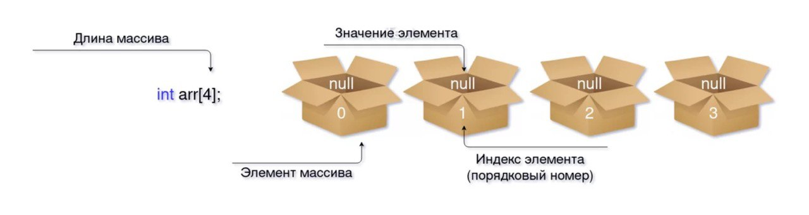
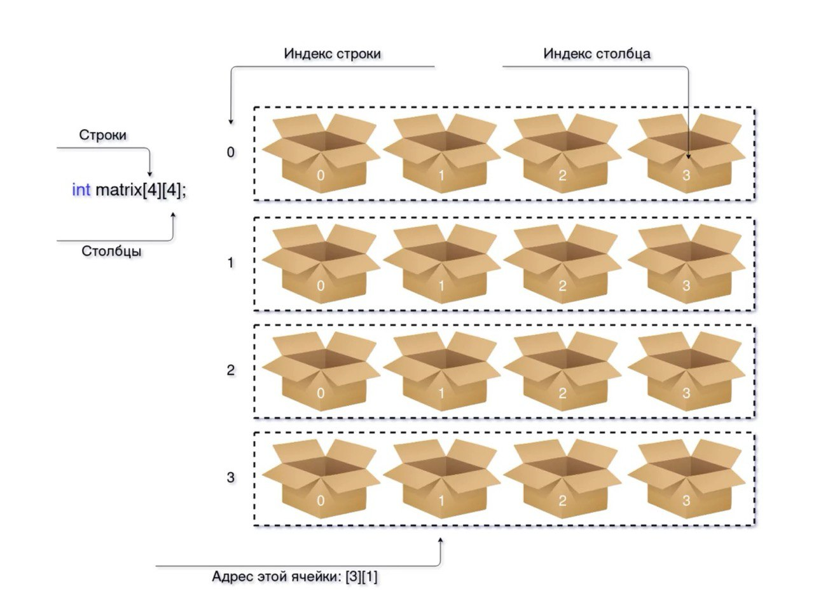

# Тема №5. Массивы 🐱

**Массив** — это определённое число ячеек памяти, расположенных подряд. Они позволяют эффективно хранить однотипные данные: зарплаты сотрудников, координаты персонажей, баллы учеников и так далее.

<div align="center">
  
</div>

На картинке выше показано объявление массива из четырёх элементов целочисленного типа. Несмотря на то что значения элементам не присваивались, массив всё равно будет занимать такой объём памяти, который занимали бы четыре переменные. В данном случае — `16 байт`.

Массивы очень удобные и быстрые: расположение ячеек друг за другом позволяет увеличить скорость работы с данными в них.

## 🤔 Как объявить массив в `C++`

Есть несколько способов объявления массивов:

```cpp
//Создание пустого массива длиной в шесть ячеек
int array1[6];

//Создание массива с данными
int array2[6] = { 0, 1, 2, 3, 4, 5 };

//Если вы сразу присваиваете ячейкам значения, то длину массива можно не указывать
int array3[] = { 0, 1, 2, 3, 4, 5 };

//Выдаст ошибку
int array4 = array3;

//Обратиться к элементу массива можно по его индексу
array1[0] = 1;
array1[1] = 2;
```

Нумерация в массивах начинается с **нуля**, а не с единицы. При этом длина остается обычной. То есть в массиве длиной в десять ячеек индекс последней будет `9`.

**Важно! Массивы — иммутабельные (неизменяемые).** Вы можете скорректировать значения отдельных элементов, но не сам массив — нельзя изменить его длину или присвоить одному массиву другой.

Всегда следите, чтобы не обращаться к ячейке данных, которая находится за пределами массива. Если длина равна `5`, а вы обратитесь к ячейке под индексом `5`, `6`, `7` и так далее, то результат может быть непредсказуемым.

```cpp
int arr[] = { 0, 1, 2, 3, 4 };
std::cout << arr[6] << "\n";
```

Вот что выведет такая программа:

```bash
2009661528
```

При этом вывод каждый раз будет разным, потому что в данный момент эта ячейка памяти может хранить что угодно.

## 🐝 Как использовать массивы в `C++`

Чтобы использовать какой-нибудь элемент массива, к нему нужно обратиться с помощью индекса. Это удобно, когда нужно получить один или два элемента, но если нужно перебрать весь массив, то лучше воспользоваться циклами:

```cpp
//Переменная, в которой будет находиться сумма всех зарплат
int sum = 0;

//Создаём массив с зарплатами
int salaries[] = { 500, 800, 200, 300, 700, 500, 600, 250 };

//Находим длину массива
int length = sizeof(salaries) / sizeof(salaries[0]);
//Для этого используется функция sizeof(), которая определяет размер переменной или массива
//Чтобы найти длину, нужно разделить размер всего массива на размер одной ячейки
//В данном случае размер ячейки - 4 байта
//Размер всего массива - 32
//32 / 4 = 8

for(int i = 0; i < length; i++)
{
    //Прибавляем к переменной sum значение каждого элемента массива
    sum += salaries[i];
}

std::cout << "Salaries sum: $" << sum << "\n";
```

Здесь выполняются операции с каждой ячейкой массива, а роль индексов выполняет итератор (переменная `i`).

Вот что выведет такая программа:

```bash
$3850
```

Также с помощью циклов можно выполнить поиск по массиву. Например, чтобы найти минимальное или максимальное число:

```cpp
int nums[] = { 1, 2, 32, 40, 100, 2, 33, 5, 6, 213, 7, 9, 2, -1 };

int min = nums[0];
int max = nums[0];

int length = sizeof(nums) / sizeof(nums[0]);

for(int i = 0; i < length; i++)
{
    if(nums[i] < min)
    {
   	 min = nums[i];
    }

    if(nums[i] > max)
    {
   	 max = nums[i];
    }
}

std::cout << "Min: " << min << "\nMax: " << max << "\n";
```

Вот что мы видим на экране:

```bash
Min: -1
Max: 213
```

Также можно использовать несколько массивов, чтобы хранить связанные данные. Например, создадим массив `names`, в котором будут имена сотрудников, и `salaries`, в котором будут зарплаты.

```cpp
//Создаём два массива, в которых совпадают индексы
//Если мы выведем значение salaries[0], то узнаем зарплату сотрудника names[0]
std::string names[] = { "Ivan", "Igor", "Boris", "Artur" };
int salaries[] = { 100, 200, 300, 77777 };

std::string name;
int index = -1;
int salary;

std::cout << "What is your name: ";
std::cin >> name;

int length = sizeof(salaries) / sizeof(salaries[0]);

for(int i = 0; i < length; i++)
{
    //Ищем элемент, в котором хранится такое имя
    if(names[i] == name)
    {
   	 //Мы можем использовать совпадение индексов, чтобы найти значение из другого массива
   	 salary = salaries[i];
   	 index = i;

   	 //Прерываем цикл, так как уже нашли то, что нам нужно
   	 break;
    }
}

std::cout << "Hello, " << name << "!\nYour ID in the system is " << index << ".\nYour salary is " << salary << "\n";
```

Вот результат:

```bash
What is your name: Artur
Hello, Artur!
Your ID in the system is 3.
Your salary is 77777
```

Вы можете использовать сокращённую запись цикла `for`:

```cpp
for(int number : nums)
{
    std::cout << number << "\n";
}
```

В этом примере `nums` — массив, а `number` — идентификатор, по которому можно обратиться к текущему элементу массива. То есть если это вторая итерация цикла, то при выводе `number` мы получим значение элемента `nums[1]`.

Также вы можете указать в качестве типа данных `auto` — тогда программа сама определит, какой массив нужно перебрать.

## 🌳 Многомерные массивы в `C++`

**Многомерные массивы** — это что-то вроде массива внутри массива. Двумерный массив называется матрицей.

<div align="center">
  
</div>

Самый простой пример матрицы — двумерная карта. Строки выполняют роль оси `X`, а столбцы — оси `Y`. С помощью такого массива можно вывести карту мини-игры.

```cpp
//Чтобы создать массив внутри массива, нужно указать фигурные скобки внутри фигурных скобок
//Например { { 1, 2}, { 3, 4 }}

//Создаём пустую матрицу
char map[10][10];

//Получаем длину ряда
int length = sizeof(map[0]) / sizeof(map[0][0]);

//Заполняем массив точками - они будут означать пустое пространство
for(int i = 0; i < length; i++)
{
    for(int j = 0; j < length; j++)
    {
   	 map[i][j] = '.';
    }
}

//Указываем координаты cтуденческого билета, который будет обозначен символом #
map[7][7] = '#';

//Указываем координаты студента
int x = 3;
int y = 5;

//Выбранное действие
int action = -1;

//Достиг ли студент цели
bool win = false;

while(true)
{
    //Очищаем терминал
    //Для Windows замените строку ниже на system("cls");
    system("clear");

    //Выводим карту на экран
    for(int i = 0; i < length; i++)
    {
   	 for(int j = 0; j < length; j++)
   	 {
   		 //Если это координаты студента, то выводим плюс
   		 if(x == j && y == i)
   		 {
   			 std::cout << " +";

   			 //Если координаты студента совпадают с координатами студенческого билета, то говорим, что он победил
   			 if(map[i][j] == '#')
   			 {
   				 win = true;
   			 }
   		 }
          else
   		 {
   			 //Иначе выводим записанный в карту символ
   			 std::cout << ' ' << map[i][j];
   		 }
   		 
   	 }

   	 //В конце каждого ряда переносим курсор на новую строку
   	 std::cout << '\n';
    }
    //Если студент победил, выходим из цикла
    if(win)
    {
   	 std::cout << "You win!\n";
   	 break;
    }

    //Спрашиваем у студента, что делать
    std::cout << "\nMove:\n1 - Up\n2 - Down\n3 - Left\n4 - Right\n5 - Exit\nAction: ";
    std::cin >> action;

    //Прерываем цикл, если студент решил выйти
    if(action == 5)
    {
   	 std::cout << "Good bye!\n";
   	 break;
    }
    //Двигаем студента, если он не выходит за пределы карты
    switch(action)
    {
   	 case 1:
   		 if(y - 1 >= 0)
   		 {
   			 y--;
   		 }
   		 break;

   	 case 2:
   		 if(y + 1 <= length)
   		 {
   			 y++;
   		 }
   		 break;

   	 case 3:
   		 if(x - 1 >= 0)
   		 {
   			 x--;
   		 }
   		 break;

   	 case 4:
        if(x + 1 <= length)
   		{
   			 x++;
   		}
   		break;
    }
}
```

Получается очень простая игра:

```bash
 . . . . . . . . . .
 . . . . . . . . . .
 . . . . . . . . . .
 . . . . . . . . . .
 . . . . . . . . . .
 . . . + . . . . . .
 . . . . . . . . . .
 . . . . . . . # . .
 . . . . . . . . . .
 . . . . . . . . . .

Move:
1 - Up
2 - Down
3 - Left
4 - Right
5 - Exit
```

## 📌 Задачи для практики

### 🔹 Задача 1. Среднее значение массива

Напишите программу, которая:  
- Запрашивает у пользователя размер массива.  
- Заполняет массив случайными числами.  
- Выводит массив.  
- Находит его среднее значение.  

**Примечания**  
- Первое число — размер массива.  
- Во второй строке выводится массив случайных чисел.  
- В третьей строке выводится среднее значение.  

---

### 🔹 Задача 2. Чётные и нечётные элементы массива

Напишите программу, которая:  
- Запрашивает у пользователя размер массива.  
- Заполняет массив числами.  
- Находит и выводит количество чётных и нечётных чисел в массиве.  

---

### 🔹 Задача 3. Минимальный и максимальный элементы массива

Напишите программу, которая:  
- Запрашивает у пользователя размер массива.  
- Заполняет массив числами.  
- Находит максимальный и минимальный элементы массива.  

---

### 🔹 Задача 4. Двумерный массив случайных чисел

Напишите программу, которая:  
- Создаёт двумерный массив размером `N×M`.  
- Заполняет его случайными числами.  
- Выводит массив на экран.  

---

### 🔹 Задача 5. Сумма элементов двумерного массива

Напишите программу, которая:  
- Запрашивает у пользователя размеры двумерного массива `N` и `M`.  
- Заполняет массив числами.  
- Находит сумму всех элементов массива. 

---

### 🔹 Задача 6. Сумма элементов главной диагонали

Напишите программу, которая:  
- Создаёт двумерный массив.  
- Заполняет его случайными числами.  
- Находит сумму элементов главной диагонали.  

**Формат ввода**  

```bash
3
```

**Формат вывода**  

```bash
7 2 4
3 5 6
8 1 9
21
```

**Примечания**  
- В примере матрица `3×3`.  
- Последняя строка — сумма элементов главной диагонали (`7 + 5 + 9 = 21`).  

---

<div align="center"> Made with ❤️ by <b>dv0retsky</b> </div>