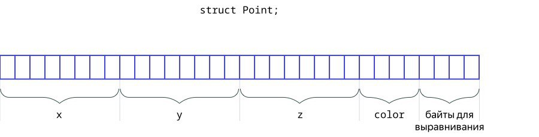

# Тема №7. Составные типы данных 🪩

**C++** позволяет конструировать новые типы данных на основе базовых типов. В этой теме мы познакомимся с перечислениями и структурами, а также рассмотрим конструкции `std::pair` и `std::tuple` из стандартной библиотеки.

<div align="center">
  
</div>

## 🪄 Перечисления

Предположим, что мы пишем программу для обработки изображений и хотим работать с цветами. Для каждого цвета заводить отдельную константу не очень удобно. Воспользуемся [**перечислением**](https://en.cppreference.com/w/cpp/language/enum.html#Scoped_enumerations) — специальным типом данных, который состоит из конечного набора именованных констант:

```cpp
enum class Color {
    White,
    Red,
    Orange,
    Blue,
};
```

Мы описали новый тип данных `Color` с четырьмя допустимыми значениями. Теперь к каждому цвету можно обращаться через префикс `Color::`:

```cpp
int main() {
    Color color1 = Color::Red;
    Color color2 = Color::Blue;
}
```

Фактически перечисления — это удобный способ описывать однотипные именованные константы. По умолчанию перечисления хранятся как тип `int`, а их значения последовательно нумеруются с нуля. И тип, и конкретное значение [можно поменять](https://en.cppreference.com/w/cpp/language/enum.html#Scoped_enumerations).

Преобразовать перечисление в число и обратно можно с помощью оператора `static_cast`:

```cpp
int value = static_cast<int>(color2);  // 3
Color color3 = static_cast<Color>(2);  // Color::Orange
```

## 🧸 Структуры

Часто хочется собрать «под одной крышей» несколько переменных. В таких случаях можно использовать структуры. Например, давайте опишем структуру точек из трёхмерного пространства:

```cpp
struct Point {
    double x = 0.0;
    double y = 0.0;
    double z = 0.0;
    Color color;  // пусть у нас будет цветная точка
};
```

В данном случае мы описали новый тип данных — `Point`, который содержит в себе четыре переменные.

Давайте поработаем с этой структурой:

```cpp
int main() {
    Point point1;  // по умолчанию координаты будут нулевыми, а color никак не будет проинициализирован
    point1.color = Color::Blue;

    Point point2 = {1.4, -2.2, -3.98, Color::Red};
    // x = 1.4, y = -2.2, z = -3.98, color = Color::Red

    point2.z = 32;  // обращаться к полям можно через точку
    point2.x += 2;  // и вообще работать с ними как с обычными переменными
}
```

В `С++20` появилась новая форма инициализации структур — [designated initializers](https://en.cppreference.com/w/cpp/language/aggregate_initialization.html):

```cpp
int main() {
    Point point3 = {.x = 1.4, .y = -2.2, .z = -3.98};
    Point point4 = {.color = Color::Orange};
}
```

Такой способ записи понятнее: сразу видно, какое поле структуры каким значением инициализируется. Важно, что поля должны быть перечислены в том же порядке, в каком они указываются при описании структуры. Пропущенные поля будут инициализироваться значением по умолчанию. Так, `point3.color` будет равно `Color::White` — нулевому значению перечисления `Color`.

## 🎁 Stack в C++

`std::stack` в языке программирования **C++** представляет собой контейнер, реализующий структуру данных "стек" (или "очередь с ограниченным доступом"). В стеке элементы добавляются и удаляются только с одного конца, называемого вершиной стека. Этот контейнер входит в Standard Template Library (STL) и предоставляет удобный интерфейс для работы с данными по принципу **"последний вошел, первый вышел"** (Last In, First Out, LIFO).

```cpp
#include <iostream>
#include <stack>


int main() {
    // Создание стека целых чисел
    std::stack<int> numbers;

    // Добавление элементов в стек
    numbers.push(1);
    numbers.push(2);
    numbers.push(3);

    // Вывод вершины стека
    std::cout << "Top of the stack: " << numbers.top() << std::endl;

    // Удаление вершины стека
    numbers.pop();

    // Проверка стека на пустоту
    if (!numbers.empty()) {
        std::cout << "Stack is not empty." << std::endl;
    } else {
        std::cout << "Stack is empty." << std::endl;
    }

    return 0;
```

Основные операции с `std::stack`:

- Добавление элементов: Элементы добавляются в `std::stack` с использованием метода `std::stack::push()`.

- Удаление элементов: Метод `std::stack::pop()` удаляет вершину стека.

- Доступ к вершине стека: Метод `std::stack::top()` позволяет получить значение вершины стека без ее удаления.

- Проверка на пустоту: Метод `std::stack::empty()` возвращает `true`, если стек пуст, и `false` в противном случае.

## 🎀 Выравнивание

Теперь давайте поговорим про размеры перечислений и структур:

```cpp
int main() {
    std::cout << sizeof(double) << "\n";  // 8
    std::cout << sizeof(Color) << "\n";   // 4 (фактически это int)
    std::cout << sizeof(Point) << "\n";   // 32
}
```

Получается, что размер структуры `Point` (`32 байта`) не равен сумме размеров её частей (`8 + 8 + 8 + 4 = 28`). Всё дело в выравнивании: компилятору не очень удобно работать со структурой в `28 байт` при условии, что внутри этой структуры есть переменные, размер которых — `8 байт` (так как `28` не кратно `8`). Поэтому компилятор резервирует за структурой несколько лишних байтов (в нашем случае — `4`).

<div align="center">
  
</div>

Можно явно попросить компилятор не выделять мнимых байтов, но в таком случае пострадает скорость — потому что если данные в памяти выровнены, то их легче достать и проще обрабатывать.

## 🚀 Кортежи и пары

В заголовочном файле `utility` есть шаблонная структура `std::pair` с полями `first` и `second`. Из названия просто догадаться, что она хранит два объекта:

```cpp
#include <iostream>
#include <utility>

int main() {
    // в угловых скобках нужно указывать два типа:
    std::pair<int, double> p = {42, 3.14};

    // обращаться к полям можно через .first и .second:
    std::cout << p.first << "\n";  // 42
    std::cout << p.second << "\n";  // 3.14
}
```

Однако у `std::pair` есть проблема — её поля обезличены, и не очень ясно, какую смысловую нагрузку несёт `first`, а какую — `second`. Из-за этого мы советуем не злоупотреблять данной структурой, кроме случаев, когда она используется в функциях стандартной библиотеки.

Обобщением пары на несколько переменных является кортеж — `std::tuple`, объявленный в заголовочном файле `tuple`:

```cpp
#include <iostream>
#include <tuple>

enum class Color { Red, Orange, Green };

struct Point {
    double x = 0.0;
    double y = 0.0;
    Color color = Color::Red;
};

int main() {
    std::tuple<int, double, Point> t = {42, 3.14, {.color = Color::Orange}};

    std::cout << std::get<0>(t) << "\n";  // 42
    std::cout << std::get<1>(t) << "\n";  // 3.14
    std::cout << std::get<2>(t).x << "\n";  // 0.0

    std::get<2>(t).color = Color::Red;
}
```

Важно понимать, что типы элементов пары или кортежа, а также размер кортежа фиксируются на этапе компиляции.

Пару, кортеж или структуру можно «распаковать» с помощью [structured binding](https://en.cppreference.com/w/cpp/language/structured_binding.html).

```cpp
#include <string>
#include <utility>

int main() {
    std::pair<std::string, int> p = {"hello", 42};
    auto [word, freq] = p;  // word = "hello"; freq = 42;
}
```

Здесь конструкция `auto [word, freq] = p` вводит две новые переменные `word` и `freq` соответствующих типов и присваивает им значения из пары.

## 📌 Задачи для практики

### 🔹 Задача. Коллекция Лабубу и отбор «элиты»

Аркадий решил системно подойти к выбору друзей, которым он бы хотел показать свою коллекцию Лабубу.
Для этого он придумал **3 критерия оценки** для каждого из друзей и внёс эти оценки в документ.

Необходимо найти **средний балл по каждому критерию** между всеми друзьями, чтобы Аркадий мог отделить ровно половину из них под «элиту».

**Формат ввода**

Сначала задаётся число `n` (от `1` до `100`) — количество друзей.

Затем следуют `n` строк, каждая из которых содержит:
- фамилию,
- имя,
- три числа (оценки по трём критериям).

Все данные разделены одним пробелом.  
Оценки принимают значение от `1` до `5`.

```bash
2
Markov Valeriy 4 5 2
Kozlov Georgiy 5 1 2
```

**Формат вывода**

Выведите три действительных числа — средний балл всех друзей по каждому критерию.   
Числа должны быть выведены **строго с одним знаком после запятой**.

```bash
4.5 3.0 2.0
```

**Примечания**

В примере выше у Аркадия два друга:
- по первому критерию: `(4 + 5) / 2 = 4.5`,
- по второму критерию: `(5 + 1) / 2 = 3.0`,
- по третьему критерию: `(2 + 2) / 2 = 2.0`.

---

<div align="center"> Made with ❤️ by <b>dv0retsky</b> </div>