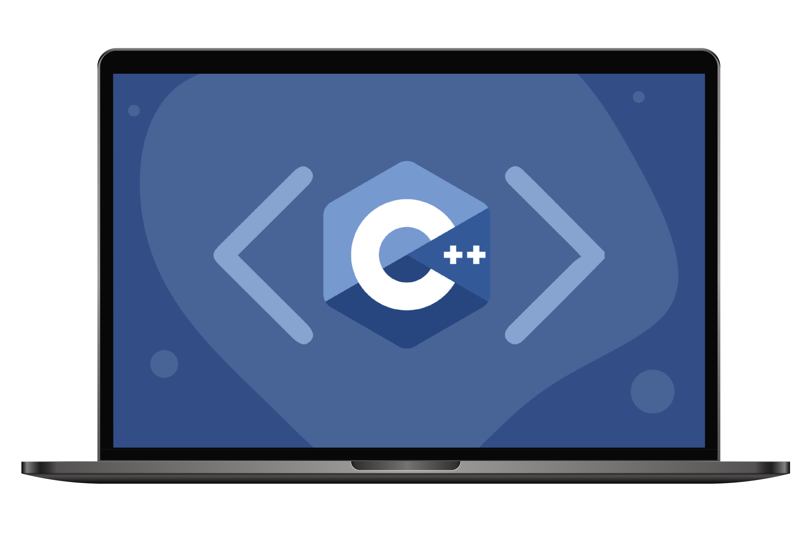

<h2 align="center">
  🐼 Программирование на C++
</h2>

<div align="center">
  
</div>

# Оглавление курса | Информатика

1. [**Введение в язык программирования С++**](./CPP1_Introduction/CPP1_Introduction.md)
2. [**Первые шаги**](./CPP2_First%20steps/CPP2_First%20steps.md)
3. [**Типы данных**](./CPP3_Data%20Types/CPP3_Data%20Types.md)
4. [**Ветвления и циклы**](./CPP4_Branching%20and%20Cycles/CPP4_Branching%20and%20Cycles.md)
5. [**Массивы**](./CPP5_Arrays/CPP5_Arrays.md)
6. [**Векторы и строки**](./CPP6_Vectors%20and%20strings/CPP6_Vectors%20and%20strings.md)
7. [**Составные типы данных**](./CPP7_Composite%20data%20types/CPP7_Composite%20data%20types.md)
8. [**Ссылки и указатели**](./CPP8_Links%20and%20pointers/CPP8_Links%20and%20pointers.md)
9. [**Функции**](./CPP9_Functions/CPP9_Functions.md)
10. [**Шаблоны**](./CPP10_Templates/CPP10_Templates.md)
11. [**Последовательные контейнеры**](./CPP11_Sequential%20containers/CPP11_Sequential%20containers.md)

<div align="center">

[](https://forthebadge.com) &nbsp;
[](https://forthebadge.com)

</div>

---

## 🚀 О проекте

Учебное пособие включает **теоретические сведения и практический материал**.  
Теоретическая часть даёт общее представление о языке программирования **C++**, его ключевых особенностях и сферах применения.

Курс предназначен для всех, кто хочет освоить фундаментальные основы процедурного и объектно-ориентированного программирования, а также понять работу системного уровня. Подходит как для начинающих, так и для тех, кто хочет углубить знания в **C++**.

---

## 🛠 Технологии и инструменты

- **Язык программирования**: C++ (C++11/C++17/C++20)
- **Компиляторы**: GCC, Clang, MSVC
- **Отладчик**: GDB, lldb
- **Сборка**: Make, CMake
- **Среды разработки**: VS Code, CLion, Qt Creator
- **Платформы**: Linux, Windows (WSL2), macOS

---

## ⚡ Быстрый старт

### Предварительные требования
- Компилятор C++ (GCC/Clang/MSVC)
- Текстовый редактор или IDE (VS Code, CLion, Qt Creator)
- Терминал или командная строка

### 1️⃣ Клонируйте репозиторий

```bash
git clone https://github.com/dv0retsky/cpp-tutorial.git

```

### 2️⃣ Перейдите в папку проекта

```bash
cd cpp-tutorial
```

### 3️⃣ Изучайте теорию в Markdown файлах

### 4️⃣ Практикуйтесь с примерами кода

---

<div align="center"> Made with ❤️ by <b>dv0retsky</b> </div>